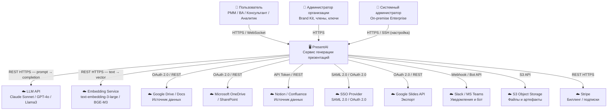

## Содержание

- [Диаграмма контекста](#диаграмма-контекста)
- [Акторы-люди](#акторы-люди)
- [Внешние системы](#внешние-системы)
- [Границы системы: что входит в scope](#границы-системы-что-входит-в-scope)
- [Вне scope](#вне-scope)

---

## Диаграмма контекста

---

## Акторы-люди

### Пользователь

| Поле | Значение |
|------|----------|
| **Актор** | Пользователь (PMM, Business Analyst, Консультант, Аналитик, Project Manager) |
| **Бизнес-цель** | Создать профессиональную презентацию на основе своих корпоративных данных за минуты, не тратя часы на ручное оформление и анализ |
| **Взаимодействие** | HTTPS (Web-интерфейс Next.js), WebSocket (стриминг прогресса генерации), REST API (прямые интеграции) |
| **Типичные действия** | Загрузить источники данных → задать цель и аудиторию → запустить генерацию → верифицировать факты → экспортировать PPTX/PDF |
| **Болевая точка** | Тратит 4–8 ч на ручное создание презентаций; LLM-инструменты галлюцинируют и не работают с корпоративными данными |
| **Источник в проекте** | [01_BR.md](./01_BR.md) — сегменты Early Adopters и Growth |

### Администратор организации

| Поле | Значение |
|------|----------|
| **Актор** | Администратор организации (org_role = admin) |
| **Бизнес-цель** | Настроить корпоративный стиль (Brand Kit), управлять доступами сотрудников, контролировать использование AI-токенов и подписку |
| **Взаимодействие** | HTTPS (Web-интерфейс, раздел Settings / Admin) |
| **Типичные действия** | Загрузить логотип и цвета → создать Brand Kit → пригласить членов → выдать/отозвать роли → посмотреть аудит-лог → управлять API-ключами |
| **Болевая точка** | Нет контроля над тем, какие данные сотрудники загружают в AI; нет корпоративного стиля в результатах |
| **Источник в проекте** | [01_BR.md](./01_BR.md) — Enterprise-сегмент; [relational.md](../../../03_backend/01_info_models/relational.md) — org_role ENUM |

### Системный администратор (on-premise)

| Поле | Значение |
|------|----------|
| **Актор** | Системный администратор Enterprise-клиента |
| **Бизнес-цель** | Развернуть PresentAI в изолированном контуре клиента с локальным LLM (vLLM + Llama3), без передачи данных в облако |
| **Взаимодействие** | HTTPS (конфигурационный интерфейс), SSH/kubectl (установка через Helm Chart), REST API |
| **Типичные действия** | Установить Helm Chart → настроить локальный LLM endpoint → подключить MinIO (S3-совместимое хранилище) → настроить SSO-интеграцию → проверить audit log |
| **Болевая точка** | Стандартные SaaS-решения не позволяют хранить данные внутри контура |
| **Источник в проекте** | [01_architecture/_index.md](../../../01_architecture/_index.md) — on-premise секция |

---

## Внешние системы

| Система | Протокол | Направление | Критичность | Источник в проекте |
|---------|----------|-------------|-------------|-------------------|
| **LLM API** (Claude Sonnet / GPT-4o / Llama3) | REST HTTPS | Исходящий | **Критическая** — основная функция системы | [01_architecture/_index.md](../../../01_architecture/_index.md) |
| **Embedding Service** (text-embedding-3-large / BGE-M3) | REST HTTPS | Исходящий | **Критическая** — блокирует индексацию документов | [vector_store.md](../../../03_backend/01_info_models/vector_store.md) |
| **Qdrant** (Vector DB) | Qdrant SDK / gRPC | Двунаправленный | **Критическая** — RAG-поиск невозможен без Qdrant | [vector_store.md](../../../03_backend/01_info_models/vector_store.md) |
| **PostgreSQL 16** | TCP / SQL | Двунаправленный | **Критическая** — основная реляционная БД | [relational.md](../../../03_backend/01_info_models/relational.md) |
| **Redis 7** | TCP | Двунаправленный | **Высокая** — сессии, очереди, checkpoint | [cache.md](../../../03_backend/01_info_models/cache.md) |
| **S3 Object Storage** (AWS S3 / Yandex S3 / MinIO) | S3 API (HTTPS) | Двунаправленный | **Высокая** — хранение файлов пользователей и артефактов | [01_architecture/_index.md](../../../01_architecture/_index.md) |
| **Google Drive / Docs** | OAuth 2.0 + REST HTTPS | Исходящий | **Средняя** — опциональный источник данных | [01_BR.md](./01_BR.md) |
| **Microsoft OneDrive / SharePoint** | OAuth 2.0 + REST HTTPS | Исходящий | **Средняя** — опциональный источник данных | [01_BR.md](./01_BR.md) |
| **Notion / Confluence** | API Token + REST HTTPS | Исходящий | **Средняя** — опциональный источник данных | [01_BR.md](./01_BR.md) |
| **SSO Provider** (Google, Microsoft, Okta) | SAML 2.0 / OAuth 2.0 | Входящий | **Высокая** — единственный метод входа для Enterprise | [01_architecture/_index.md](../../../01_architecture/_index.md) |
| **Google Slides API** | OAuth 2.0 + REST HTTPS | Исходящий | **Низкая** — опциональный формат экспорта | [01_architecture/_index.md](../../../01_architecture/_index.md) |
| **Slack / MS Teams** | Webhook / Bot API (HTTPS) | Исходящий | **Низкая** — уведомления и slash-команды | [01_architecture/_index.md](../../../01_architecture/_index.md) |
| **Stripe** | REST HTTPS | Исходящий | **Средняя** — управление подписками и биллингом | [relational.md](../../../03_backend/01_info_models/relational.md) — `subscriptions.external_subscription_id` |
| **MongoDB 7.0** | MongoDB Protocol / TCP | Двунаправленный | **Средняя** — трейсы генерации, аналитика | [documents.md](../../../03_backend/01_info_models/documents.md) |

---

## Границы системы: что входит в scope

| # | Функциональность |
|---|-----------------|
| 1 | Загрузка пользовательских документов (PDF, DOCX, XLSX, CSV, PPTX, URL, изображения) |
| 2 | Индексация документов через RAG-пайплайн: chunking (512 токенов, overlap 64), embedding, хранение в Qdrant |
| 3 | Импорт данных из Google Drive, OneDrive/SharePoint, Notion, Confluence через OAuth |
| 4 | Генерация структуры презентации (outline) на основе данных пользователя |
| 5 | Генерация контента слайдов с атрибуцией источников (каждый факт — со ссылкой на chunk) |
| 6 | Постпроцессинг: удаление AI-клише, проверка числовых утверждений, флаги галлюцинаций |
| 7 | Стриминг прогресса генерации через WebSocket |
| 8 | Итеративное редактирование: смена тональности, регенерация отдельного слайда |
| 9 | Brand Kit: корпоративные цвета, шрифты, логотип, PPTX-шаблон |
| 10 | Экспорт в PPTX (python-pptx), PDF, Google Slides, PNG, Web (PWA) |
| 11 | Управление пользователями и организациями с RBAC (admin / editor / viewer) |
| 12 | SSO-аутентификация (SAML 2.0, OAuth 2.0); MFA для Enterprise |
| 13 | API-ключи для внешних интеграций с rate limiting |
| 14 | Webhook-система с гарантиями доставки (at-least-once, HMAC-SHA256) |
| 15 | Биллинг: тарифные планы (Free / Pro / Team / Enterprise), учёт токенов |
| 16 | Аудит-лог всех значимых действий (90 дней хранения) |
| 17 | Мультитенантность: RLS (Free/Pro), per-tenant schema (Enterprise), on-premise |
| 18 | Соответствие 152-ФЗ (данные граждан РФ в RU-регионе) и GDPR (право на удаление) |
| 19 | Аналитика просмотров публичных ссылок на презентации |
| 20 | Управление промпт-шаблонами для A/B-тестирования без деплоя |

---

## Вне scope

| # | Функциональность | Обоснование |
|---|-----------------|-------------|
| 1 | Генерация изображений через AI (DALL-E, Stable Diffusion) | Правовые риски (авторское право); используются лицензированные библиотеки Shutterstock/Getty |
| 2 | Полноценный видеоредактор / анимации слайдов | Вне фокуса продукта на горизонте 2025–2026 |
| 3 | Синхронное совместное редактирование (Google Docs-style) | Реализация требует отдельной CRDT-инфраструктуры; не является NSM-метрикой |
| 4 | Хранение и обработка персональных данных третьих лиц | Система работает с корпоративными данными; DPA-соглашения покрывают пользователей |
| 5 | Голосовой ввод / диктовка контента | Не входит в текущую дорожную карту |
| 6 | Fine-tuning LLM-моделей (только промпт-инжиниринг) | Fine-tuning рассматривается как горизонт 18 месяцев |
| 7 | Встроенная система видеоконференций / презентаций | Интеграция осуществляется через экспорт в Google Slides |
| 8 | Публичный маркетплейс шаблонов | Вне дорожной карты MVP и Growth-фаз |
