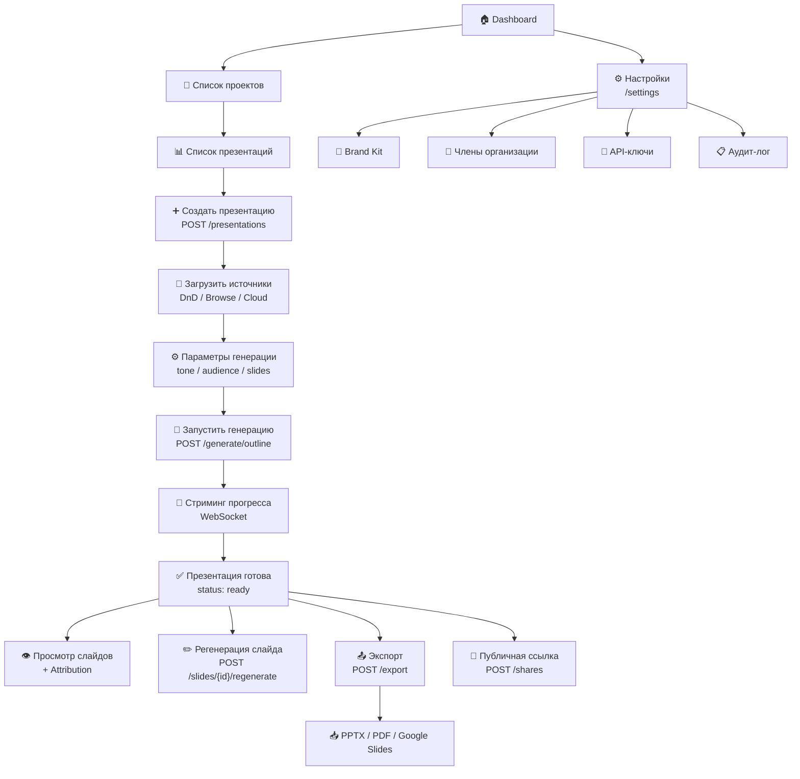

## Содержание

- [Пользовательский интерфейс](#пользовательский-интерфейс)
- [REST API](#rest-api)
- [WebSocket](#websocket)
- [Внешние интеграции](#внешние-интеграции)

---

## Пользовательский интерфейс

Фронтенд реализован на **Next.js 14 (React)** с SSR. Подробная документация: [02_frontend/_index.md](../../02_frontend/_index.md).

### Ключевые экраны

| Экран | Путь | Назначение |
|-------|------|-----------|
| Главная / Dashboard | `/dashboard` | Список организаций, последние проекты и презентации |
| Список проектов | `/projects` | CRUD проектов организации |
| Список презентаций | `/projects/{id}` | Список презентаций проекта с фильтрами и поиском |
| Редактор презентации | `/presentations/{id}` | Источники данных, параметры, слайды, прогресс генерации |
| Просмотр слайда | `/presentations/{id}/slides/{n}` | Детальный просмотр слайда с attribution |
| Публичный просмотр | `/share/{token}` | Анонимный просмотр по публичной ссылке |
| Brand Kit | `/settings/brand-kits` | Управление корпоративным стилем |
| Настройки организации | `/settings/organization` | Члены, роли, API-ключи, Webhooks, биллинг |
| Аудит-лог | `/settings/audit-log` | Журнал действий (только admin) |
| Профиль пользователя | `/settings/profile` | Данные профиля, OAuth-подключения, MFA |

### Навигационные сценарии



---

## REST API

Полная спецификация: [03_backend/02_rest_methods/_index.md](../../03_backend/02_rest_methods/_index.md) (OpenAPI / Swagger).

**Базовый URL:** `https://api.present.ai/api/v1`

**Аутентификация:**
- Web-интерфейс: `Authorization: Bearer {jwt}` (JWT access-token, 15 мин)
- API-интеграции: `X-API-Key: {api_key}`

**Content-Type:** `application/json` (кроме file upload — `multipart/form-data`)

### Сводная таблица ресурсов и методов

| Ресурс | Method | Endpoint | Описание | FR |
|--------|--------|----------|----------|----|
| **Auth** | POST | `/auth/register` | Регистрация по email | FR-025 |
| | POST | `/auth/login` | Вход (email+password) | FR-025 |
| | POST | `/auth/sso/{provider}` | SSO OAuth callback | FR-026 |
| | POST | `/auth/mfa/verify` | Верификация TOTP | FR-027 |
| | POST | `/auth/logout` | Выход | FR-028 |
| | POST | `/auth/logout-all` | Завершение всех сессий | FR-028 |
| | POST | `/auth/refresh` | Обновление access-token | FR-026 |
| **Users** | GET | `/users/me` | Профиль текущего пользователя | FR-033 |
| | PATCH | `/users/me` | Обновление профиля | FR-033 |
| | DELETE | `/users/me` | Удаление аккаунта (GDPR) | FR-034 |
| | POST | `/users/me/export-data` | Экспорт персональных данных | FR-040 |
| **Organizations** | POST | `/organizations` | Создание организации | FR-029 |
| | GET | `/organizations/{id}` | Детали организации | FR-029 |
| | PATCH | `/organizations/{id}` | Обновление организации | FR-029 |
| | GET | `/organizations/{id}/members` | Список членов | FR-030 |
| | POST | `/organizations/{id}/members/invite` | Приглашение | FR-030 |
| | PATCH | `/organizations/{id}/members/{uid}` | Изменение роли | FR-031 |
| | DELETE | `/organizations/{id}/members/{uid}` | Удаление члена | FR-031 |
| | GET | `/organizations/{id}/usage` | Потребление токенов | FR-038 |
| | GET | `/organizations/{id}/audit-logs` | Аудит-лог | FR-050 |
| | POST | `/organizations/{id}/audit-logs/export` | Экспорт аудит-лога в CSV | FR-050 |
| | GET | `/organizations/{id}/subscription` | Текущая подписка | FR-039 |
| | POST | `/organizations/{id}/subscription/upgrade` | Апгрейд плана | FR-039 |
| | POST | `/organizations/{id}/subscription/cancel` | Отмена подписки | FR-039 |
| **Projects** | POST | `/projects` | Создание проекта | FR-032 |
| | GET | `/projects` | Список проектов | FR-032 |
| | GET | `/projects/{id}` | Детали проекта | FR-032 |
| | PATCH | `/projects/{id}` | Обновление / архивирование | FR-032 |
| | DELETE | `/projects/{id}` | Удаление пустого проекта | FR-032 |
| **Brand Kits** | POST | `/brand-kits` | Создание Brand Kit | FR-041 |
| | GET | `/brand-kits` | Список Brand Kit | FR-041 |
| | GET | `/brand-kits/{id}` | Детали Brand Kit | FR-041 |
| | PATCH | `/brand-kits/{id}` | Обновление Brand Kit | FR-041 |
| | DELETE | `/brand-kits/{id}` | Удаление Brand Kit | FR-041 |
| | POST | `/brand-kits/{id}/template` | Загрузка PPTX-шаблона | FR-042 |
| **Presentations** | POST | `/presentations` | Создание презентации | FR-010 |
| | GET | `/presentations` | Список презентаций | FR-035 |
| | GET | `/presentations/{id}` | Детали + слайды | FR-035 |
| | PATCH | `/presentations/{id}` | Обновление параметров | FR-035 |
| | DELETE | `/presentations/{id}` | Мягкое удаление | FR-035 |
| | POST | `/presentations/{id}/duplicate` | Дублирование | FR-035 |
| | POST | `/presentations/{id}/generate/outline` | Генерация outline | FR-011 |
| | POST | `/presentations/{id}/generate/slides` | Генерация всех слайдов | FR-012 |
| | GET | `/presentations/{id}/sources` | Список источников | FR-008 |
| | POST | `/presentations/{id}/sources` | Добавление источника | FR-001 |
| | DELETE | `/presentations/{id}/sources/{sid}` | Удаление источника | FR-009 |
| | POST | `/presentations/{id}/export` | Запуск экспорта | FR-018 |
| | GET | `/presentations/{id}/export/{eid}` | Статус экспорта | FR-018 |
| | POST | `/presentations/{id}/shares` | Создание публичной ссылки | FR-022 |
| | GET | `/presentations/{id}/shares` | Список ссылок | FR-022 |
| | DELETE | `/presentations/{id}/shares/{sid}` | Отзыв ссылки | FR-022 |
| | GET | `/presentations/{id}/analytics` | Аналитика просмотров | FR-024 |
| **Slides** | POST | `/presentations/{id}/slides` | Добавление пустого слайда | FR-037 |
| | GET | `/slides/{id}` | Детали слайда | FR-037 |
| | PATCH | `/slides/{id}` | Редактирование контента | FR-037 |
| | DELETE | `/slides/{id}` | Удаление слайда | FR-037 |
| | POST | `/slides/{id}/regenerate` | Регенерация слайда | FR-016 |
| | GET | `/slides/{id}/versions` | История версий | FR-017 |
| | POST | `/slides/{id}/restore/{vnum}` | Откат версии | FR-017 |
| | POST | `/presentations/{id}/slides/reorder` | Изменение порядка | FR-037 |
| **Files** | POST | `/files/upload` | Загрузка файла | FR-001 |
| | POST | `/files/url` | Импорт по URL | FR-003 |
| | GET | `/files/{id}` | Статус индексации | FR-008 |
| **OAuth** | GET | `/oauth/{provider}/authorize` | Инициация OAuth-flow | FR-004 |
| | GET | `/oauth/{provider}/callback` | OAuth callback | FR-004 |
| | DELETE | `/oauth/{provider}` | Отключение OAuth | FR-004 |
| **API Keys** | POST | `/api-keys` | Создание ключа | FR-044 |
| | GET | `/api-keys` | Список ключей | FR-045 |
| | POST | `/api-keys/{id}/rotate` | Ротация ключа | FR-045 |
| | DELETE | `/api-keys/{id}` | Отзыв ключа | FR-045 |
| **Webhooks** | POST | `/webhooks` | Создание подписки | FR-046 |
| | GET | `/webhooks` | Список подписок | FR-046 |
| | PATCH | `/webhooks/{id}` | Обновление подписки | FR-046 |
| | DELETE | `/webhooks/{id}` | Удаление подписки | FR-046 |
| | GET | `/webhooks/{id}/events` | История доставки | FR-048 |
| | POST | `/webhooks/{id}/events/{eid}/resend` | Ручная повторная отправка | FR-048 |
| **Public** | GET | `/share/{token}` | Просмотр по публичной ссылке | FR-023 |
| **Admin** | GET | `/admin/prompt-templates` | Список промпт-шаблонов | FR-051 |
| | POST | `/admin/prompt-templates` | Создание версии шаблона | FR-051 |
| | PATCH | `/admin/prompt-templates/{id}` | Активация / A/B вес | FR-052 |
| | GET | `/admin/quality-metrics` | Метрики качества генерации | FR-054 |

### Коды ошибок API

| HTTP Status | Error Code | Описание |
|-------------|-----------|---------|
| 400 | `bad_request` | Невалидные параметры запроса |
| 401 | `unauthorized` | Отсутствует или невалидный JWT/API-ключ |
| 403 | `insufficient_role` | Недостаточно прав (RBAC) |
| 403 | `insufficient_scope` | API-ключ не имеет нужного scope |
| 404 | `not_found` | Ресурс не найден |
| 409 | `conflict` | Конфликт (дубликат email, slug) |
| 410 | `gone` | Ресурс удалён (download_url истёк) |
| 413 | `file_too_large` | Превышен лимит размера файла |
| 415 | `unsupported_file_type` | Формат файла не поддерживается |
| 422 | `validation_error` | Ошибка валидации бизнес-правил |
| 429 | `rate_limit_exceeded` | Превышен rate limit; `retry_after` в ответе |
| 429 | `token_limit_exceeded` | Превышен месячный лимит токенов |
| 503 | `llm_unavailable` | LLM-провайдеры недоступны; `retry_after` в ответе |

**Формат ошибки:**
```json
{
  "error": "insufficient_role",
  "message": "This action requires editor role or higher",
  "required": "editor",
  "current": "viewer",
  "request_id": "req_018e9a1f-b3c2"
}
```

---

## WebSocket

**Endpoint:** `wss://api.present.ai/ws`

**Аутентификация:** JWT передаётся как query-параметр: `wss://api.present.ai/ws?token={jwt}` или через первое сообщение `{"type": "auth", "token": "..."}`.

**Формат сообщений:** JSON.

### События от сервера к клиенту

```typescript
// Прогресс генерации outline
interface OutlineGeneratedEvent {
  type: "outline_generated";
  job_id: string;
  presentation_id: string;
  outline: OutlineItem[];
}

// Прогресс генерации слайда
interface SlideCompletedEvent {
  type: "slide_completed";
  job_id: string;
  slide_id: string;
  slide_number: number;
  slide_title: string;
  progress_pct: number;          // 0–100
  timestamp: number;             // Unix ms
}

// Завершение генерации
interface GenerationDoneEvent {
  type: "generation_done";
  job_id: string;
  presentation_id: string;
  total_slides: number;
  total_duration_ms: number;
}

// Ошибка генерации
interface GenerationErrorEvent {
  type: "generation_error";
  job_id: string;
  error_code: string;
  error_message: string;
  slide_number?: number;         // Если ошибка на конкретном слайде
}

// Завершение индексации источника
interface IngestionCompletedEvent {
  type: "ingestion_completed";
  source_document_id: string;
  ingestion_status: "indexed" | "failed";
  chunks_created?: number;
  error_message?: string;
}

// Завершение экспорта
interface ExportCompletedEvent {
  type: "export_completed";
  export_job_id: string;
  presentation_id: string;
  format: "pptx" | "pdf" | "google_slides" | "png";
  download_url?: string;
  google_file_id?: string;
}
```

### Сообщения от клиента к серверу

```typescript
// Аутентификация (альтернатива query-параметру)
interface AuthMessage {
  type: "auth";
  token: string;
}

// Подписка на события конкретной задачи
interface SubscribeMessage {
  type: "subscribe";
  job_id: string;
  last_event_id?: string;        // Для переподключения без пропуска событий
}

// Отписка
interface UnsubscribeMessage {
  type: "unsubscribe";
  job_id: string;
}

// Heartbeat (клиент → сервер каждые 30 сек)
interface PingMessage {
  type: "ping";
}
```

**Поведение при переподключении:** Клиент передаёт `last_event_id` из последнего полученного события. Сервер читает Redis Stream `gen_progress:{job_id}` начиная с `last_event_id` через `XREAD STREAMS gen_progress:{job_id} {last_event_id}`.

---

## Внешние интеграции

| Система | Протокол | Направление | Данные | Поведение при недоступности |
|---------|----------|-------------|--------|-----------------------------|
| **LLM API** (Anthropic Claude Sonnet) | REST HTTPS | Исходящий | `{messages, model, max_tokens}` → `{content, usage}` | Circuit Breaker → fallback GPT-4o → HTTP 503 с `retry_after: 60` |
| **LLM API Fallback** (OpenAI GPT-4o) | REST HTTPS | Исходящий | Аналогично Claude | При недоступности: HTTP 503; в трейсе `fallback_triggered: false` (оба недоступны) |
| **LLM API on-premise** (vLLM + Llama3) | REST HTTP (internal) | Исходящий | OpenAI-совместимый API | Только для Enterprise on-premise; fallback не настраивается |
| **Embedding Service** (text-embedding-3-large) | REST HTTPS | Исходящий | `{input: [text]}` → `{data: [{embedding: float[3072]}]}` | Блокирует индексацию документов; задача переходит в `ingestion_status = failed`; retry через 5 мин |
| **Embedding Service on-premise** (BGE-M3) | REST HTTP (internal) | Исходящий | Аналогично; output float[1024] | Только Enterprise; при падении — `ingestion_status = failed` |
| **Qdrant** | Qdrant SDK / gRPC | Двунаправленный | Upsert/Search/Delete векторов | При недоступности: деградированный режим генерации без RAG; предупреждение пользователю |
| **Google Drive API v3** | REST HTTPS + OAuth 2.0 | Исходящий | `GET /files/{id}?alt=media` → файл | HTTP 503: задача индексации `failed`; пользователь уведомлён |
| **Microsoft Graph API** | REST HTTPS + OAuth 2.0 | Исходящий | `GET /me/drive/items/{id}/content` → файл | HTTP 503: аналогично Google Drive |
| **Notion API v1** | REST HTTPS + API Token | Исходящий | `GET /blocks/{id}/children` → блоки | HTTP 503: `ingestion_status = failed` |
| **Confluence REST API v2** | REST HTTPS + Basic (email:token) | Исходящий | `GET /wiki/rest/api/content/{id}` → страница | HTTP 503: `ingestion_status = failed` |
| **Google Slides API v1** | REST HTTPS + OAuth 2.0 | Исходящий | `POST /presentations` → Google Slides file | HTTP 503: `export_jobs.status = failed`; PPTX-экспорт остаётся доступным |
| **SSO Provider** (Google/Microsoft/Okta) | SAML 2.0 / OAuth 2.0 | Входящий/Исходящий | Assertion/token → user identity | Fallback: email+password вход (если настроен); иначе — вход заблокирован для SSO-только пользователей |
| **Slack / MS Teams** | Webhook HTTPS / Bot API | Исходящий | JSON payload → уведомление | Webhook недоступен: событие из `webhook_events` ретрается по exponential backoff; после 5 попыток — `abandoned` |
| **Stripe** | REST HTTPS + API Key | Исходящий | `POST /checkout/sessions` → payment session; Webhook events | Недоступность Stripe: биллинговые операции откладываются; генерация продолжает работать для активных подписок |
| **S3 Object Storage** | S3 API (HTTPS) | Двунаправленный | PutObject / GetObject / DeleteObject | Критическая недоступность: загрузка файлов блокируется; существующие генерации без влияния (источники уже в Qdrant) |
| **MongoDB** | MongoDB Protocol / TCP | Двунаправленный | Insert/Find документов `generation_traces`, `presentation_analytics` | При недоступности: трейсы буферизуются в Redis (LIST) до восстановления; основная функция генерации продолжает работать |
