Раздел описывает целевую архитектуру решения: состав подсистем, их ответственности и взаимодействия. Здесь фиксируются ключевые архитектурные решения, допущения и ограничения, влияющие на реализацию и эксплуатацию.

Материалы используются как опорная точка для согласования интерфейсов, распределения ответственности между компонентами и оценки последствий изменений.

# Архитектурный документ: AI-сервис генерации презентаций

> **Версия:** 1.0 | **Дата:** 28.02.2026 | **Статус:** Ready for Development

---

## Executive Summary

Сервис генерации презентаций строится на принципе **«смысл прежде дизайна»**: RAG-пайплайн извлекает данные из пользовательских источников, LLM формирует аргументированную структуру, шаблонизатор применяет корпоративный Brand Kit, и только затем генерируется финальный слайд-дек.

**Ключевые архитектурные решения:**

| Решение | Выбор | Обоснование |
|---|---|---|
| Бэкенд | Python (FastAPI) | Нативная экосистема ML/AI, async, высокая производительность |
| AI-оркестрация | LangChain + LangGraph | Зрелый RAG-фреймворк, поддержка агентов и итеративных цепочек |
| LLM (основной) | Claude claude-sonnet-4-6 / GPT-4o (fallback) | Качество генерации, мультимодальность, API-доступность |
| Векторное хранилище | Qdrant | Производительность, self-hosted вариант для on-premise |
| СУБД | PostgreSQL + Redis | Надёжность + кэширование/очереди |
| Очереди задач | Celery + Redis / AWS SQS | Асинхронная обработка тяжёлых файлов |
| Генерация PPTX | python-pptx | Нативная библиотека, полная редактируемость |
| Фронтенд | Next.js (React) | SSR, производительность, богатая экосистема |
| Инфраструктура | Kubernetes (EKS/GKE) | Горизонтальное масштабирование, управление ресурсами |

**Целевые показатели надёжности:** uptime 99.5%, Time-to-First-Slide < 5 сек, генерация 15 слайдов < 60 сек.

---

## Этап 0. Анализ бизнес-контекста и архитектурных драйверов

### Прогнозируемые нагрузки

**Временные горизонты и DAU:**

| Период | MAU | DAU | Пик RPS (генерация) |
|---|---|---|---|
| Мес. 3 | 5 000 | 500 | 5–10 |
| Мес. 6 | 25 000 | 2 500 | 25–50 |
| Мес. 12 | 100 000 | 10 000 | 100–200 |

**Объём генерируемого контента:**
- Средний размер входных данных: 2–15 МБ (PDF/DOCX/XLSX)
- Средний размер итогового PPTX: 3–8 МБ
- Презентаций на активного пользователя: 6–8/мес
- Расчётный объём хранилища на 12 мес.: ~50 ТБ

**Требования к скорости отклика:**

| Операция | Синхронная цель | Критическое значение |
|---|---|---|
| Генерация outline | < 10 сек | < 20 сек |
| Генерация одного слайда | < 5 сек | < 10 сек |
| Полная презентация (15 слайдов) | < 60 сек | < 120 сек |
| Обработка файла 50 МБ | < 30 сек (async) | < 60 сек |
| Экспорт PPTX | < 15 сек | < 30 сек |
| Смена тональности | < 30 сек | < 60 сек |

**Целевой uptime:** 99.5% (≈ 43 часа простоя в год допустимо).

**Географическое распределение:** Приоритет — РФ и СНГ (152-ФЗ), затем EU (GDPR). Основной регион развёртывания — РФ или EU-West с репликацией.

### Ранжирование атрибутов качества

| Приоритет | Атрибут | Обоснование |
|---|---|---|
| 1 | **Экономическая эффективность (AI-затраты)** | LLM API — главная статья COGS; без контроля марже не выжить при масштабировании |
| 2 | **Безопасность данных и compliance** | Блокирует Enterprise-сегмент без 152-ФЗ/GDPR/on-premise; без него нет B корпоративных продаж |
| 3 | **Устойчивость к сбоям** | Потеря сессии генерации = потеря доверия; критично для платящих пользователей |
| 4 | **Горизонтальное масштабирование** | Рост нагрузки в 20× за год требует архитектуры без single bottleneck |
| 5 | **Гибкость замены AI-компонентов** | Рынок LLM меняется быстро; vendor lock-in на одну модель — стратегический риск |
| 6 | **Удобство разработки** | Важно, но вторично относительно продуктовых атрибутов |

---

## Этап 1. Архитектурные требования и ограничения

### Мультитенантность и изоляция данных

Применяется **гибридная модель** изоляции:

- **Free/Pro:** общая БД PostgreSQL со схемой `tenant_id` во всех таблицах. Row-level security (RLS).
- **Team:** общая БД + отдельный S3 bucket per организация для файлов.
- **Enterprise:** опция отдельной схемы PostgreSQL или выделенного инстанса. On-premise: полная изоляция в контуре клиента.

Векторное хранилище (Qdrant): коллекция per tenant с namespace-изоляцией.

### Безопасность и соответствие стандартам

- **Аутентификация:** SSO через SAML 2.0 и OAuth 2.0 (Google, Microsoft, Okta). MFA обязателен для Enterprise.
- **Авторизация:** RBAC на уровне организации и проекта (Admin / Editor / Viewer).
- **Шифрование:** AES-256 at-rest, TLS 1.3 in-transit.
- **152-ФЗ:** данные граждан РФ хранятся в российском регионе.
- **GDPR:** право на удаление, право на экспорт, DPA-соглашения.
- **SOC 2 Type II:** дорожная карта — 18 месяцев после запуска.
- **Аудит:** полный audit log всех действий (кто, что, когда) с хранением 90 дней.

### Интеграция с внешними экосистемами

**Источники данных (входящие):** Google Drive, Microsoft OneDrive/SharePoint (OAuth 2.0), Notion, Confluence (API Token), URL web scraping, file upload (PDF, DOCX, XLSX, CSV, PPTX).

**Рабочее окружение (исходящие события):** Slack slash-command, Microsoft Teams App, webhooks.

**Форматы вывода:** PPTX, PDF, Google Slides (API), веб-ссылка (PWA), PNG/JPEG.

**Влияние на API-дизайн:** публичный REST API + webhook-система с гарантиями доставки, OAuth 2.0 для сторонних интеграций, rate limiting per tenant.

---

## Этап 2. Технологический стек

### Итоговый выбор технологий

| Компонент | Технология | Версия/уровень |
|---|---|---|
| Бэкенд API | Python 3.12 + FastAPI | Production |
| AI-оркестрация | LangChain + LangGraph | Production |
| LLM (primary) | Anthropic Claude API (Sonnet) | Production |
| LLM (fallback) | OpenAI GPT-4o | Failover |
| LLM (on-premise) | vLLM + Llama 3 / Mistral | Enterprise |
| Embeddings | text-embedding-3-large / BGE-M3 | Production |
| Векторное хранилище | Qdrant | Production |
| Реляционная БД | PostgreSQL 16 | Production |
| Кэш / Брокер | Redis 7 (Cluster) | Production |
| Очереди задач | Celery + Redis | Production |
| Object Storage | S3-совместимое (AWS S3 / Yandex S3) | Production |
| Генерация PPTX | python-pptx | Production |
| Парсинг документов | Apache Tika / unstructured.io | Production |
| Генерация графиков | Matplotlib + Plotly | Production |
| Фронтенд | Next.js 14 (React) | Production |
| Realtime | WebSocket (FastAPI native) | Production |
| Gateway | Kong / AWS API Gateway | Production |
| Контейнеризация | Docker + Kubernetes | Production |
| IaC | Terraform + Helm | Production |
| CI/CD | GitHub Actions | Production |
| Мониторинг | Prometheus + Grafana + Jaeger | Production |
| Логирование | ELK Stack (Elasticsearch, Logstash, Kibana) | Production |

---

## Этап 3. Детальное проектирование архитектуры

### 3.1 Высокоуровневая диаграмма C4 (уровень 1 — System Context)

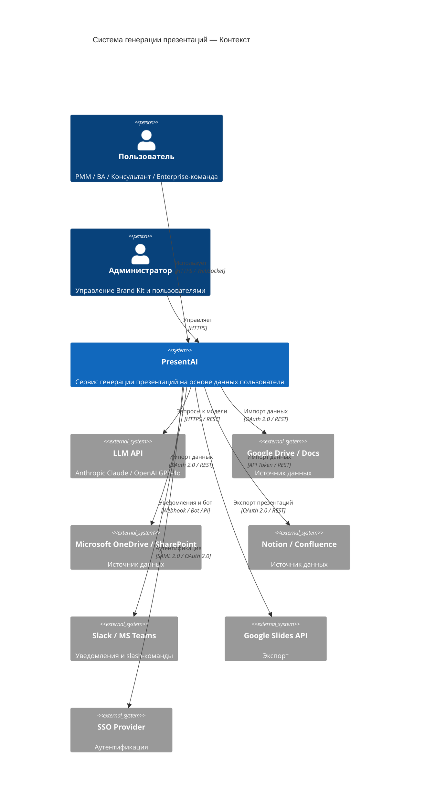

### 3.2 Диаграмма C4 (уровень 2 — Контейнеры)

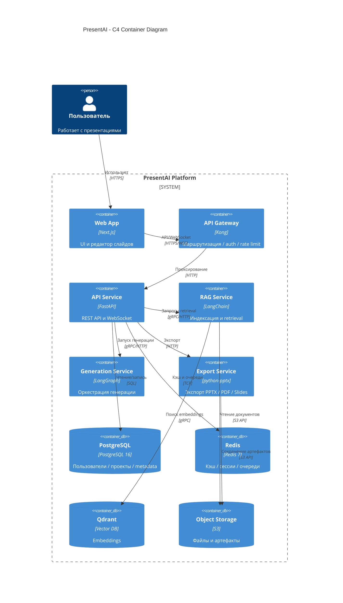

### 3.3 Диаграмма высокоуровневой архитектуры (компоненты)

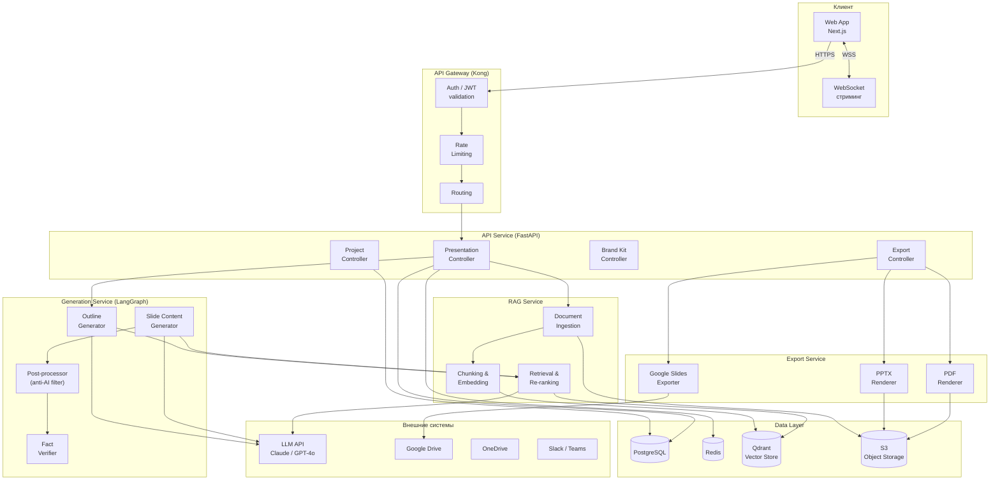

## 3.4 RAG-пайплайн и обработка данных

### Приём и обработка источников данных

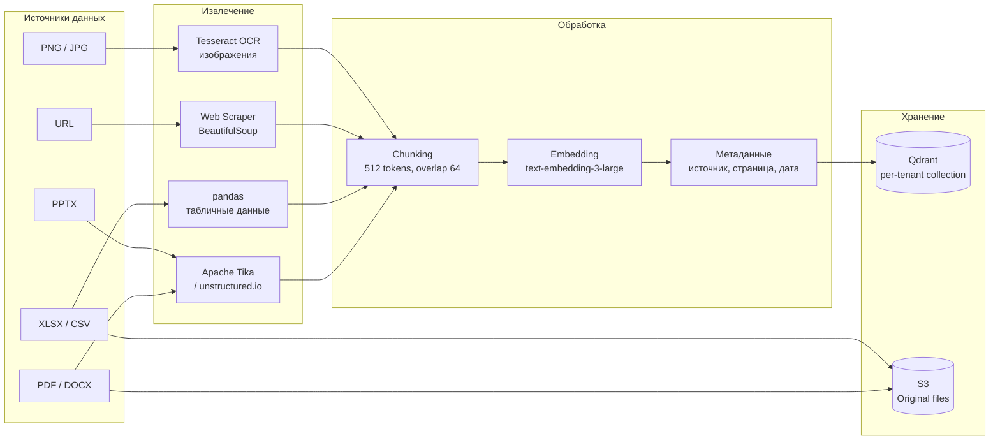

### Механизмы обеспечения достоверности и борьба с галлюцинациями

**Стратегия атрибуции источников:**
- Каждый chunk при ingestion сохраняет метаданные: `source_file`, `page_number`, `url`, `extracted_at`.
- При генерации слайда модель получает релевантные chunks с метаданными и обязана явно ссылаться на источник в структурированном JSON-ответе.
- Интерфейс отображает иконку-ссылку рядом с каждым фактом; при наведении — preview оригинального фрагмента.

**Проверка числовых утверждений (AI-002):**
1. Пост-процессор парсит числа из сгенерированного текста.
2. Для каждого числа выполняется поиск в векторном хранилище: есть ли chunk с этим числом в ±5% диапазоне?
3. Если совпадения нет — утверждение помечается флагом «⚠ Источник: знания модели».
4. Противоречия между источниками (одна метрика с разными значениями) детектируются на этапе ingestion при сравнении embeddings с высоким cosine-similarity но разными числовыми значениями.

**Пайплайн генерации с проверкой:**

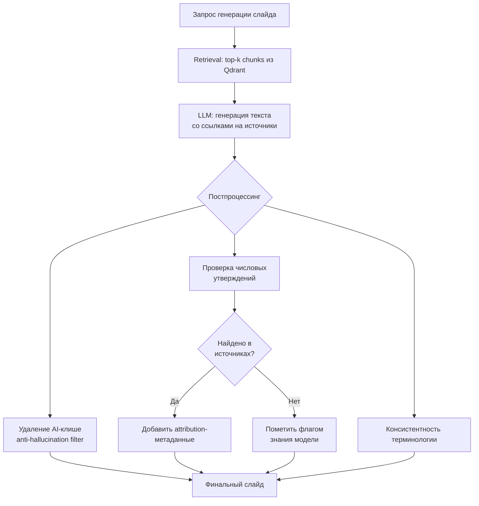

**Предотвращение AI-клише (NFR-102):**
- Системный промпт содержит список запрещённых конструкций.
- Выходной постпроцессор на основе регулярных выражений и классификатора заменяет паттерны.
- Целевая метрика: GPTZero классифицирует текст как «человеческий» с P > 70%.

---

## 3.5 Интеграционная архитектура для Enterprise

### Публичный API

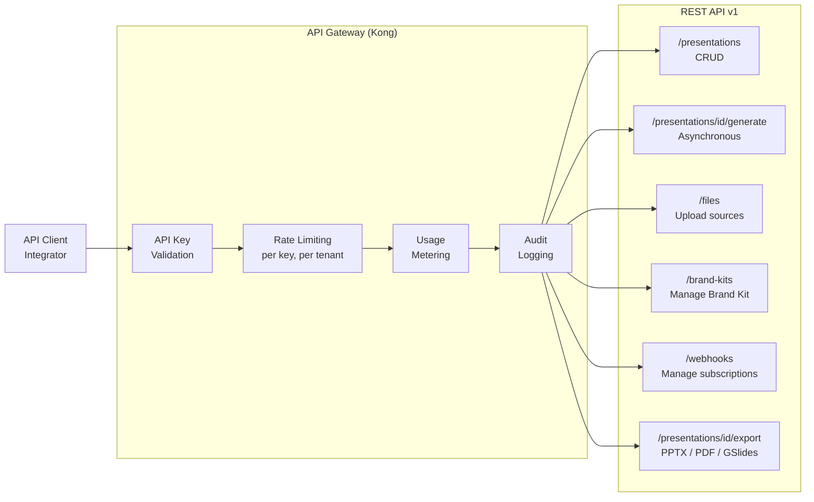

**Модель авторизации API:**
- API Key per организация с возможностью создания нескольких ключей с разными scope.
- Rate limits: Free — 10 req/min, Pro — 60 req/min, Enterprise — custom.
- Usage metering: billing по количеству сгенерированных слайдов ($0.05/слайд).

### Webhook-система с гарантиями доставки

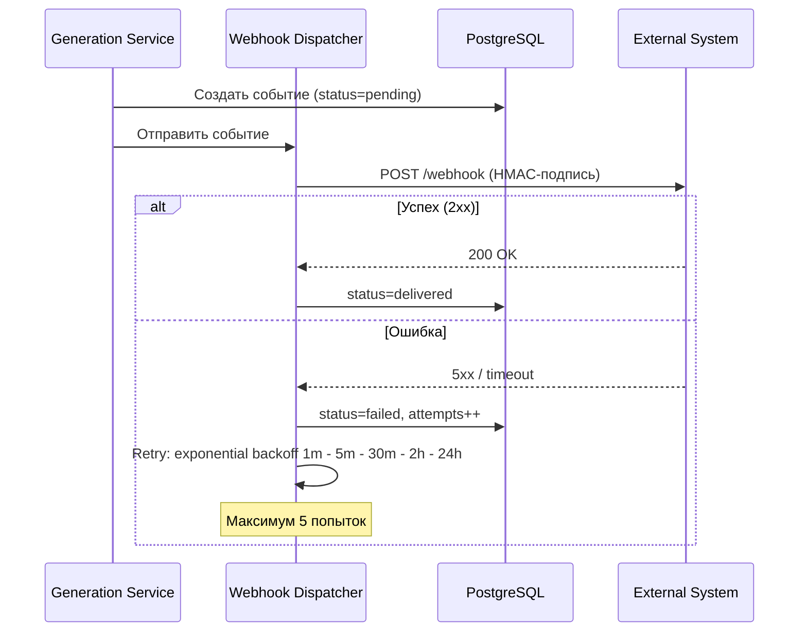

**Гарантии доставки:** at-least-once; идемпотентность на стороне клиента через `event_id`. Хранение событий 7 дней. HMAC-SHA256 подпись для верификации.

**События:** `presentation.generation.started`, `presentation.generation.completed`, `presentation.generation.failed`, `presentation.exported`, `file.processed`.

### Адаптеры экспорта

| Формат | Технология | Особенности |
|---|---|---|
| PPTX | python-pptx | Нативные объекты PowerPoint, встроенные шрифты, редактируемые графики |
| PDF | WeasyPrint / Puppeteer | Векторный, закладки по слайдам |
| Google Slides | Google Slides API v1 | OAuth 2.0, создание в Drive пользователя |
| Web (PWA) | Next.js SSG | Responsive, аналитика просмотров |
| PNG | Playwright headless | Рендеринг слайда через браузер |

---

## Этап 4. Операционные аспекты

### Observability

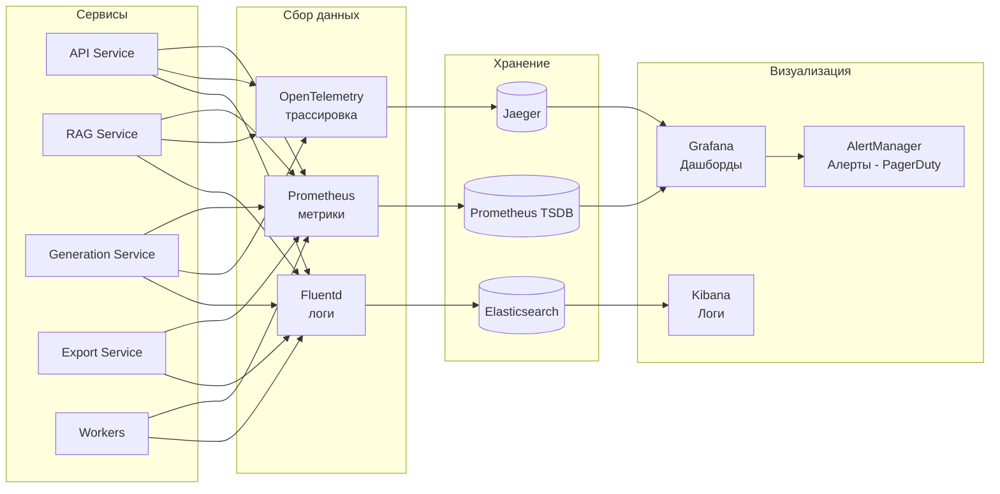

**Ключевые метрики:**

| Категория | Метрика | Порог алерта |
|---|---|---|
| Производительность | P99 latency генерации outline | > 15 сек |
| Производительность | P99 latency full presentation | > 120 сек |
| Доступность | Uptime API | < 99.5% |
| AI-качество | LLM API error rate | > 2% |
| Бизнес | Presentations generated/hour | Падение > 30% от базового |
| Стоимость | LLM API spend / hour | > порога бюджета |
| Очереди | Celery queue depth | > 500 задач |

**Трассировка:** каждый запрос генерации имеет `trace_id`, который проходит через все сервисы. Особо трассируются: retrieval latency, LLM call latency, postprocessing latency.

### Паттерны отказоустойчивости

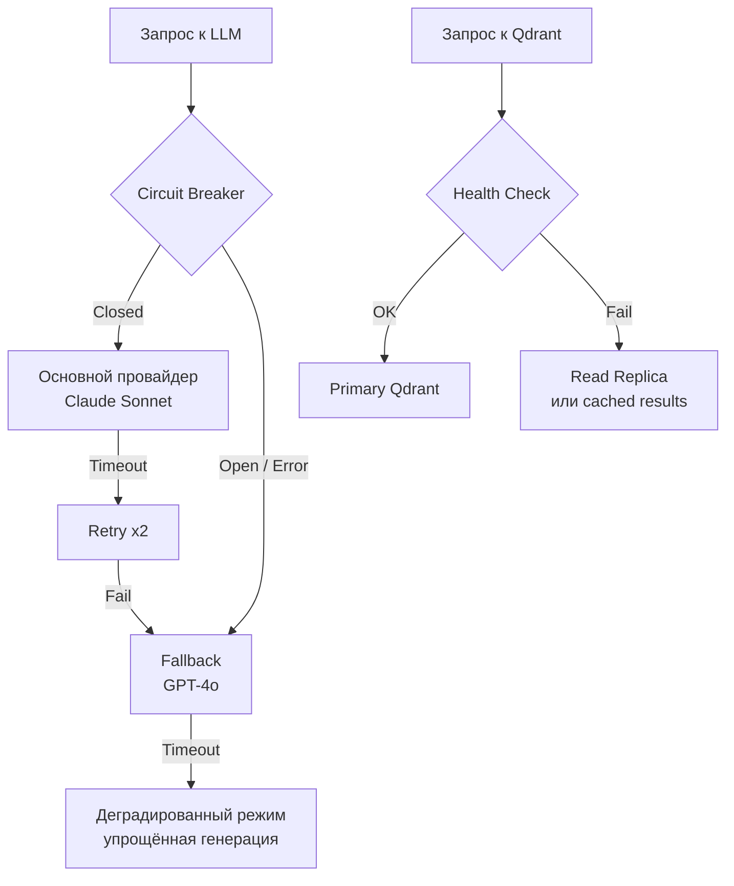

**Паттерны:**
- **Circuit Breaker** для всех внешних API (LLM, Google Drive, OneDrive).
- **Retry с exponential backoff** для идемпотентных операций.
- **Graceful degradation:** при недоступности векторного хранилища — генерация только из промпта без RAG с предупреждением пользователю.
- **Streaming генерация:** слайды рендерятся по мере готовности — потеря соединения теряет только незаконченный слайд, не всю презентацию.
- **Checkpoint-based recovery:** состояние генерации сохраняется в Redis после каждого слайда.

### Резервное копирование и восстановление

| Компонент | Стратегия | RPO | RTO |
|---|---|---|---|
| PostgreSQL | Continuous WAL archiving + daily snapshot | 5 мин | 30 мин |
| Qdrant | Periodic snapshot → S3 (каждые 6 часов) | 6 часов | 1 час |
| S3 (файлы) | Cross-region replication | Real-time | Мгновенно |
| Redis | AOF + RDB snapshot | 1 мин | 15 мин |

### Управление затратами (Cost-Aware Architecture)

**Структура LLM-затрат на 1 презентацию (15 слайдов):**

| Операция | Токены (оценка) | Стоимость |
|---|---|---|
| Генерация outline | ~2 000 | $0.01–0.02 |
| Генерация 15 слайдов | ~15 000 | $0.06–0.10 |
| Postprocessing / verification | ~3 000 | $0.01–0.02 |
| Embeddings (RAG ingestion) | ~10 000 | $0.001 |
| **Итого** | **~30 000** | **$0.08–0.15** |

**Механизмы оптимизации:**
1. **Semantic caching:** похожие outline-запросы (~cosine similarity > 0.95) отдаются из кэша без вызова LLM.
2. **Model tiering:** для outline и постпроцессинга — более дешёвая модель (Haiku / GPT-4o mini); для финальной генерации слайдов — основная.
3. **Batching:** несколько слайдов генерируются в одном LLM-запросе где возможно.
4. **Usage anomaly detection:** алерт при превышении среднего потребления токенов на пользователя в 5×.
5. **Fair-use policy для Enterprise:** soft-лимит с уведомлением при превышении в 3× от плана.

---

## Этап 5. Развёртывание и жизненный цикл

### Инфраструктура как код

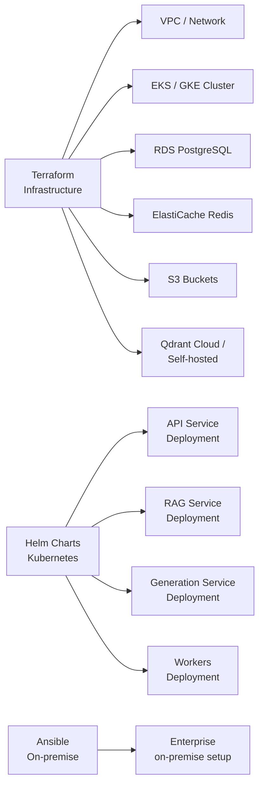

**Окружения:** `dev` → `staging` → `production` (EU/RU). Все конфиги хранятся в Git. Secrets через Vault / AWS Secrets Manager.

### CI/CD Pipeline

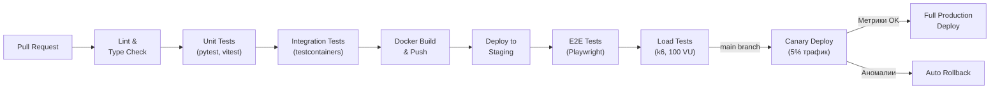

### Стратегии обновления без простоя

**Для stateless-сервисов (API, RAG, Export):** Rolling update с health check. Kubernetes `maxSurge: 25%`, `maxUnavailable: 0`.

**Для Generation Service (AI-компоненты):** Canary deployment:
1. 5% трафика → новая версия.
2. Мониторинг 30 мин: error rate, P99 latency, quality metrics.
3. При отсутствии аномалий — постепенное увеличение до 100%.
4. При аномалиях — автоматический откат.

**Для моделей (prompts/LangGraph chains):** A/B тестирование через feature flags (LaunchDarkly). Новая цепочка генерации активируется для 10% пользователей с мониторингом CSAT.

**Для баз данных:** Zero-downtime migrations через backward-compatible схемы (expand → migrate → contract). Инструмент: Alembic.

---

## Этап 6. Альтернативные решения и анализ компромиссов

### Альтернатива 1: Микросервисы vs Модульный монолит

| Критерий | Микросервисы (выбрано) | Модульный монолит |
|---|---|---|
| Масштабирование | Независимое масштабирование AI-компонентов | Только вертикально или целиком |
| Операционная сложность | Высокая (K8s, service mesh) | Низкая |
| Замена AI-компонентов | Изолированно, без риска для остальных | Требует полного деплоя |
| Time to market (MVP) | Медленнее на старте | Быстрее на старте |
| Команда < 5 чел. | Overhead значительный | Оптимально |
| Команда 10+ чел. | Оптимально | Coordination hell |

**Решение:** Начать с **модульного монолита** (MVP, 0–6 мес.), разрезать на сервисы по мере роста команды и нагрузки. Граница разреза определена заранее (RAG, Generation, Export — независимые модули).

### Альтернатива 2: Векторное хранилище

| Критерий | Qdrant (выбрано) | Pinecone | pgvector |
|---|---|---|---|
| Self-hosted / on-premise | Да (Docker) | Нет (SaaS only) | Да |
| Производительность (>1M vectors) | Отличная | Отличная | Приемлемая |
| Стоимость | Open Source | $70+/мес | Бесплатно (в PostgreSQL) |
| Namespace изоляция (multitenancy) | Да | Да | Через schema/table |
| Enterprise требование | Критично | Блокер | Ок |

**Решение:** Qdrant — единственный вариант с production-ready self-hosted для on-premise Enterprise.

### Альтернатива 3: Подход к генерации изображений

| Критерий | Лицензированные библиотеки (выбрано) | AI-генерация (DALL-E / SD) | Иконочные наборы |
|---|---|---|---|
| Правовые риски | Нет | Высокие (авторское право) | Нет |
| Качество | Стабильное | Непредсказуемое | Ограниченное |
| Стоимость | Фиксированная лицензия | $0.04/изображение | Бесплатно |
| Соответствие контексту | Ручной подбор AI | Высокое | Среднее |

**Решение:** Лицензированные библиотеки (Shutterstock/Getty API) + иконочные наборы (Font Awesome, Phosphor). AI-генерация изображений — только по явному запросу пользователя с предупреждением.

---

## Этап 7. План верификации архитектуры

### Виды тестирования

| Тип | Инструмент | Покрытие / Сценарий |
|---|---|---|
| Unit-тесты | pytest, vitest | >80% coverage, RAG-цепочки, постпроцессор |
| Integration-тесты | testcontainers (PostgreSQL, Redis, Qdrant) | Полный пайплайн ingestion→retrieval→generation |
| Contract-тесты | Pact | API между сервисами |
| E2E-тесты | Playwright | Ключевые user journeys: upload→generate→export |
| Load-тесты | k6 | 200 concurrent users, 30 мин; цель P99 < 10 сек |
| Chaos-тесты | Chaos Mesh | Отключение Qdrant, LLM timeout, Redis failover |
| AI Quality-тесты | GPTZero API, ручная оценка | NFR-102 (anti-AI), NFR-103 (attribution) |
| Security-тесты | OWASP ZAP, Trivy | OWASP Top 10, уязвимости контейнеров |

### Пилотное внедрение

**Фаза 1 (Мес. 1–2):** Closed beta с 50 пользователями из сегмента Early Adopters. Метрики: Time-to-First-Deck, CSAT, количество итераций до экспорта.

**Фаза 2 (Мес. 3):** Open beta. Нагрузочное тестирование с реальным трафиком. Мониторинг LLM-затрат и unit economics.

**Фаза 3 (Мес. 4–6):** Enterprise pilot с 2–3 компаниями. Тестирование on-premise деплоя, Brand Kit, SSO.

---

## Этап 8. Матрица рисков и митигация

| # | Риск | Вероятность | Влияние | Приоритет | Митигация |
|---|---|---|---|---|---|
| R-01 | Vendor lock-in на LLM API (Anthropic/OpenAI недоступны) | Средняя | Критическое | Высокий | Абстракция LLM-слоя через LangChain. Fallback: Claude → GPT-4o → Llama 3 on-premise. Контракт на резервный API. |
| R-02 | Рост LLM-затрат при масштабировании | Высокая | Высокое | Высокий | Semantic caching, model tiering, fair-use policy, мониторинг cost/presentation. Горизонт 18 мес: fine-tuned open-source модель. |
| R-03 | Утечка корпоративных данных пользователей | Низкая | Критическое | Высокий | Шифрование AES-256 + TLS 1.3. Изоляция per-tenant в S3 и Qdrant. On-premise для Enterprise. Audit log. Регулярный pentest. |
| R-04 | Деградация качества генерации на русском | Средняя | Высокое | Высокий | Тестирование моделей на RU corpus. Fine-tuning на деловых текстах RU. Постпроцессор с RU-специфичными фильтрами. |
| R-05 | Быстрый выход Microsoft Copilot / Google Gemini с аналогом | Высокая | Критическое | Высокий | Фокус на нише (консалтинг, корпоративные данные). On-premise как барьер для Enterprise. Скорость итераций > BigTech. |
| R-06 | Производительность Qdrant при росте > 10M векторов | Средняя | Среднее | Средний | Horizontal sharding Qdrant. Индексирование HNSW. Автоматическая очистка старых embeddings (TTL 90 дней). |
| R-07 | Пользователи не готовы платить (AI fatigue) | Средняя | Среднее | Средний | Агрессивный Free tier с реальной ценностью. ROI-калькулятор. NPS-мониторинг. |
| R-08 | Проблемы с авторским правом на дизайн-ассеты | Низкая | Среднее | Низкий | Только лицензированные библиотеки (Shutterstock, Getty). AI-генерация изображений только по явному consent. Юридическая проверка. |
| R-09 | Сложность on-premise деплоя для Enterprise | Средняя | Высокое | Средний | Docker Compose + Helm Chart. Поддержка air-gapped установки. Цель: < 4 часов с документацией. |
| R-10 | Несоответствие требованиям 152-ФЗ / GDPR | Низкая | Критическое | Высокий | Данные граждан РФ — только в RU-регионе. DPA-соглашения. Right to erasure. Консультация с DPO. |

---

## Инфраструктурная схема развёртывания

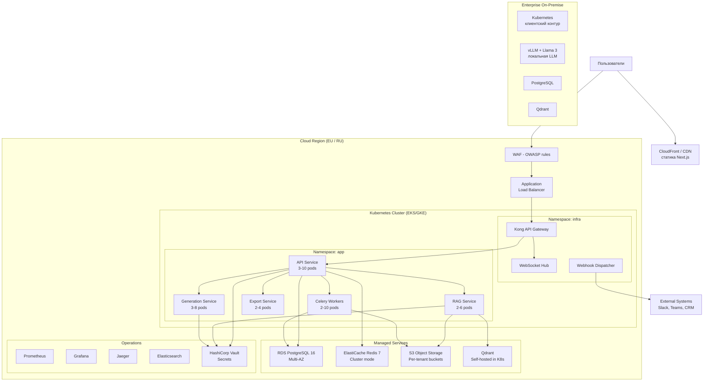

**Конфигурация autoscaling:**

| Сервис | Min pods | Max pods | HPA trigger |
|---|---|---|---|
| API Service | 3 | 10 | CPU > 60% |
| Generation Service | 3 | 8 | Queue depth > 50 |
| RAG Service | 2 | 6 | CPU > 70% |
| Celery Workers | 2 | 10 | Queue depth > 100 |
| Export Service | 2 | 4 | CPU > 70% |

---

## Приложение: Описание ключевых компонентов

### API Service (FastAPI)
Центральный оркестратор. Отвечает за: аутентификацию и авторизацию (JWT + RBAC), маршрутизацию запросов к downstream сервисам, управление состоянием проектов и презентаций в PostgreSQL, WebSocket-соединения для стриминга прогресса генерации.

### RAG Service (LangChain)
Отвечает за весь пайплайн работы с данными пользователя: ingestion документов (Tika/unstructured), chunking, генерацию embeddings, хранение в Qdrant с per-tenant изоляцией, retrieval с re-ranking при генерации.

### Generation Service (LangGraph)
Реализует stateful граф генерации: `outline_node → [slide_gen_node × N] → postprocess_node → verify_node`. Поддерживает: checkpoint-based recovery, streaming output через WebSocket, итеративное улучшение в рамках сессии (AI-003).

### Export Service (python-pptx)
Рендеринг финального PPTX с нативными объектами PowerPoint: встроенными шрифтами, редактируемыми диаграммами Matplotlib, Brand Kit-параметрами. Конвертация в PDF через LibreOffice headless. Интеграция с Google Slides API.

### Task Workers (Celery)
Асинхронная обработка тяжёлых задач: ingestion больших файлов (> 5 МБ), генерация полных презентаций (non-interactive mode), массовый экспорт, отправка webhook-событий с retry.

---

*Документ подготовлен на основе PRD «Бизнес-контекст и БТ» для хакатона Axenix, трек «Промпт-инжиниринг», 2026.*
