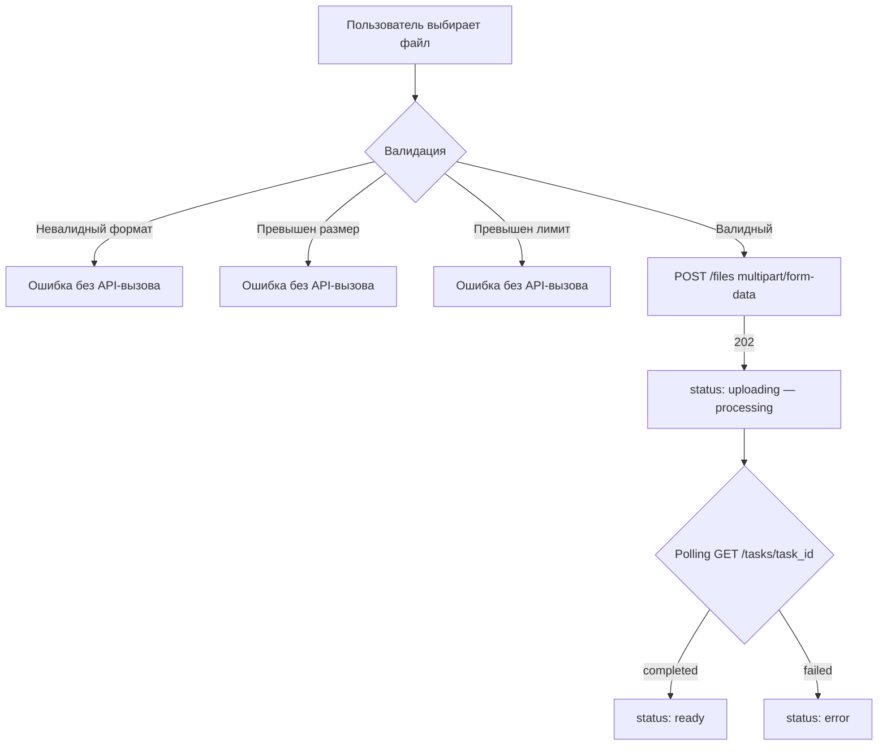

## Содержание

- [Сводная таблица](#сводная-таблица)
- [Переиспользуемые компоненты](#переиспользуемые-компоненты)
  - [WizardStepper](#wizardstepper)
  - [FileUploader](#fileuploader)

---

## Сводная таблица

| Компонент          | Тип       | Экраны                           | Переиспользуется |
|--------------------|-----------|----------------------------------|:----------------:|
| `Navbar`           | organism  | landing                          | нет              |
| `HeroSection`      | organism  | landing                          | нет              |
| `AppPreview`       | molecule  | landing                          | нет              |
| `WizardHeader`     | organism  | wizard_step1, wizard_step2       | да               |
| `WizardStepper`    | molecule  | wizard_step1, wizard_step2       | да               |
| `TopicTextarea`    | molecule  | wizard_step1                     | нет              |
| `FileUploader`     | organism  | wizard_step1                     | да               |
| `AudienceSelector` | organism  | wizard_step2                     | нет              |
| `AudienceCard`     | atom      | wizard_step2 (внутри Selector)   | нет              |
| `GoalTextarea`     | molecule  | wizard_step2                     | нет              |
| `FooterActions`    | molecule  | wizard_step2                     | да               |

**Типы компонентов (Atomic Design):**
- **atom** — неделимый UI-элемент: кнопка, иконка, badge.
- **molecule** — комбинация атомов с единой логикой.
- **organism** — самодостаточный блок экрана, может содержать бизнес-логику.
- **layout** — структурный контейнер без бизнес-логики.
- **page** — корневой компонент маршрута Next.js.

---

## Переиспользуемые компоненты

---

### `WizardStepper`

**Тип:** molecule
**Назначение:** Визуальный индикатор прогресса многошагового wizard. Отображает текущий шаг, завершённые и предстоящие.

**Экраны:** [wizard_step1](./screens/wizard_step1.md), [wizard_step2](./screens/wizard_step2.md)

#### Props

| Prop          | Тип            | Обязательный | Описание                                                    |
|---------------|----------------|:------------:|-------------------------------------------------------------|
| `steps`       | `StepConfig[]` | Да           | Конфигурация шагов: `{ id: number; label: string; status: StepStatus }` |
| `currentStep` | `number`       | Да           | Индекс (1-based) активного шага                             |

```typescript
type StepStatus = "pending" | "active" | "completed";

interface StepConfig {
  id: number;
  label: string;
  status: StepStatus;
}
```

**Пример использования:**

```typescript
// Шаг 1 активен
const steps: StepConfig[] = [
  { id: 1, label: "Данные и контент", status: "active" },
  { id: 2, label: "Аудитория и цель", status: "pending" },
];

// Шаг 2 активен, шаг 1 завершён
const steps: StepConfig[] = [
  { id: 1, label: "Данные и контент", status: "completed" },
  { id: 2, label: "Аудитория и цель", status: "active" },
];
```

#### Визуальные состояния шага

| `StepStatus`  | Стиль круга                        | Стиль коннектора               |
|---------------|------------------------------------|--------------------------------|
| `pending`     | Серый круг, белый номер            | Серая линия                    |
| `active`      | Фиолетовый круг, белый номер       | Серая линия (к следующему)     |
| `completed`   | Фиолетовый круг, белая галочка     | Фиолетовая линия               |

#### Состояния компонента

- `step_1_active` — круг 1 фиолетовый, круг 2 серый, коннектор серый.
- `step_2_active` — круг 1 фиолетовый (завершён), коннектор фиолетовый, круг 2 фиолетовый (активен).

---

### `FileUploader`

**Тип:** organism
**Назначение:** Drag-and-drop зона загрузки файлов с валидацией типа и размера, очередью загрузки, отображением статуса каждого файла и кнопкой удаления.

**Экраны:** [wizard_step1](./screens/wizard_step1.md)

#### Props

| Prop              | Тип                          | Обязательный | По умолчанию                        | Описание                                              |
|-------------------|------------------------------|:------------:|-------------------------------------|-------------------------------------------------------|
| `files`           | `UploadedFile[]`             | Да           | `[]`                                | Текущий список загруженных файлов                     |
| `onFilesChange`   | `(files: File[]) => void`    | Да           | —                                   | Коллбек при добавлении новых файлов через диалог/DnD  |
| `onFileRemove`    | `(fileId: string) => void`   | Да           | —                                   | Коллбек удаления файла из списка                      |
| `maxFiles`        | `number`                     | нет          | `5`                                 | Максимальное число файлов                             |
| `maxSizeMb`       | `number`                     | нет          | `50`                                | Максимальный размер одного файла в МБ                 |
| `acceptedFormats` | `string[]`                   | нет          | `['pdf','docx','xlsx','csv']`       | Допустимые MIME / расширения                          |
| `presentationId`  | `string \| undefined`        | нет          | `undefined`                         | UUID презентации для `POST /files?presentation_id=…`  |

```typescript
interface UploadedFile {
  fileId: string;       // uuid — из FileUploadResponse.file_id
  name: string;
  sizeBytes: number;
  status: FileStatus;   // uploading | processing | ready | error
  errorMessage?: string;
}

type FileStatus = "uploading" | "processing" | "ready" | "error";
```

#### Состояния компонента

| Состояние      | Описание                                                                          |
|----------------|-----------------------------------------------------------------------------------|
| `empty`        | Drop-зона отображает иконку + «Нажмите для выбора файлов / или перетащите их сюда» |
| `dragover`     | Drop-зона подсвечивается (фиолетовый border + фоновый тint) при наведении файла  |
| `uploading`    | Файл в списке с прогресс-баром / спиннером; статус `uploading`                   |
| `processing`   | Файл загружен в S3, идёт индексация; статус `processing`; спиннер               |
| `ready`        | Файл успешно проиндексирован; статус `ready`; зелёная галочка                    |
| `error`        | Ошибка загрузки/индексации; красный крест; `errorMessage` под именем файла       |
| `limit_reached`| Кнопка «Добавить ещё» скрыта / drop-зона недоступна после 5 файлов              |

#### Алгоритм загрузки



#### Связь с API

| Действие             | Метод | Эндпоинт | Тело                                                          |
|----------------------|-------|----------|---------------------------------------------------------------|
| Добавление файла     | POST  | `/files` | `multipart/form-data`: `file` (binary) + `presentation_id?`  |
| Проверка статуса     | GET   | `/tasks/{task_id}` | Опционально: если `FileUploadResponse.task_id` передан |
| Удаление файла       | DELETE | `/files/{file_id}` | Только если `presentationId` существует             |

---

### `WizardHeader`

**Тип:** organism
**Назначение:** Упрощённая шапка wizard: логотип + «← Вернуться к дашборду».

**Экраны:** wizard_step1, wizard_step2

> Нет сложных состояний. Props: `logoHref: string`, `backLabel: string`, `backHref: string`. Подробнее — в [wizard_step1.md](./screens/wizard_step1.md#wizardheader).

---

### `FooterActions`

**Тип:** molecule
**Назначение:** Панель кнопок в нижней части страницы wizard с действиями «Назад» и «Далее / Создать структуру».

**Экраны:** wizard_step2 (потенциально переиспользуется на всех шагах)

> Props и состояния — в [wizard_step2.md](./screens/wizard_step2.md#footeractions).
