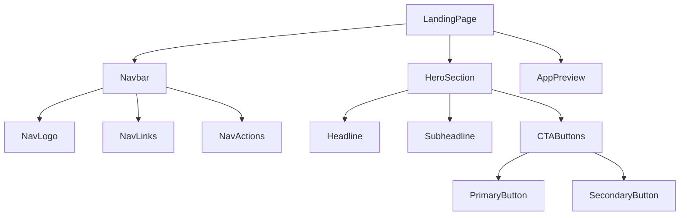
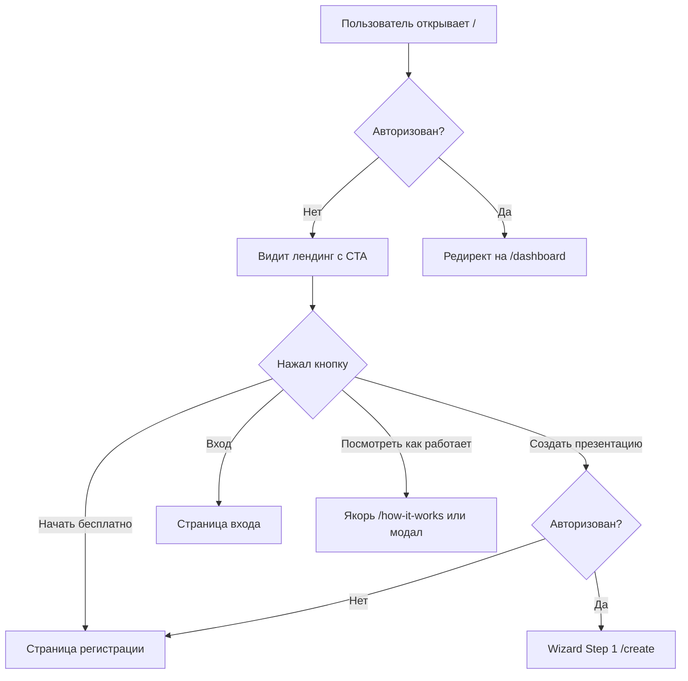

## Содержание

- [Обзор](#обзор)
- [Компоненты экрана](#компоненты-экрана)
- [Пользовательский сценарий](#пользовательский-сценарий)
- [Связь с API](#связь-с-api)
- [Валидации на фронте](#валидации-на-фронте)
- [Примечания](#примечания)

---

## Обзор

**Роут:** `/`
**Доступ:** публичный, авторизация не требуется
**Назначение:** Первая точка входа для новых пользователей. Формирует ценностное предложение DeckAI и направляет посетителя к регистрации или созданию первой презентации.

---

## Компоненты экрана

---

### `Navbar`

**Тип:** organism
**Назначение:** Глобальная шапка публичных страниц — логотип, навигационные ссылки, кнопки входа и регистрации.

| Prop / State  | Тип                   | Описание                                                        |
|---------------|-----------------------|-----------------------------------------------------------------|
| `logo`        | `string`              | URL SVG-логотипа DeckAI (фиолетовая звезда + текст)            |
| `navLinks`    | `NavLink[]`           | Массив пунктов меню: `{ label, href }`                         |
| `isAuthed`    | `boolean`             | Если `true` — скрыть «Вход» / «Начать бесплатно», показать аватар |

**Состояния компонента:**
- `idle` — стандартное отображение: логотип слева, ссылки по центру, кнопки справа.

**Навигационные ссылки (из скриншота):**

| Label                  | href (предположительно) |
|------------------------|------------------------|
| Возможности            | `/#features`           |
| Тарифы                 | `/#pricing`            |
| Как это работает       | `/#how-it-works`       |
| Вход                   | `/login`               |
| Начать бесплатно       | `/register`            |

---

### `HeroSection`

**Тип:** organism
**Назначение:** Главный блок страницы — заголовок, подзаголовок, две CTA-кнопки.

| Prop / State     | Тип      | Описание                                               |
|------------------|----------|--------------------------------------------------------|
| `headline`       | `string` | Основной заголовок (двухстрочный, вторая строка — акцент) |
| `subheadline`    | `string` | Вспомогательный текст под заголовком                   |
| `primaryCta`     | `{ label: string; href: string }` | Кнопка «Создать презентацию»  |
| `secondaryCta`   | `{ label: string; href: string }` | Кнопка «Посмотреть как работает» |

**Тексты (из скриншота):**

- Headline (строка 1): **«Профессиональные презентации»** (тёмный цвет)
- Headline (строка 2): **«на основе ваших данных»** (фиолетовый градиент)
- Subheadline: «Загрузите свои данные и цель — получите профессиональную презентацию с правильной логикой, реальными фактами и вашим корпоративным стилем за минуты, а не часы.»
- Primary CTA: «⚡ Создать презентацию» (фиолетовая заливка)
- Secondary CTA: «Посмотреть как работает» (outlined/ghost)

**Состояния компонента:**
- `idle` — статичный контент, нет загрузки.

---

### `AppPreview`

**Тип:** molecule
**Назначение:** Визуальный блок ниже CTA — имитирует превью интерфейса приложения, создаёт ощущение продукта.

| Prop / State    | Тип      | Описание                              |
|-----------------|----------|---------------------------------------|
| `placeholderIcon` | `string` | Иконка (sparkle DeckAI logo)        |
| `label`          | `string` | «Превью интерфейса создания презентации» |

**Состояния компонента:**
- `placeholder` — текущее состояние по скриншоту: белая карточка с фиолетовой sparkle-иконкой и подписью. Реальный скриншот/видео приложения не подключён.
---

## Пользовательский сценарий

**Шаги:**
1. Пользователь открывает корневой маршрут `/`.
2. Если пользователь авторизован — клиентский редирект на `/dashboard`.
3. Если нет — отображается лендинг.
4. «Создать презентацию» → проверка авторизации → `/create` или `/register`.
5. «Начать бесплатно» / «Вход» → соответствующие роуты аутентификации.

---

## Связь с API

Лендинг не выполняет API-запросов. Все переходы — клиентская маршрутизация Next.js.

| Действие                       | Метод | Эндпоинт | Примечание             |
|--------------------------------|-------|-----------|------------------------|
| Проверка сессии при загрузке   | —     | —         | JWT из cookie / localStorage; нет HTTP-запроса |

---

## Валидации на фронте

На лендинге нет форм ввода, валидация не требуется.

---
