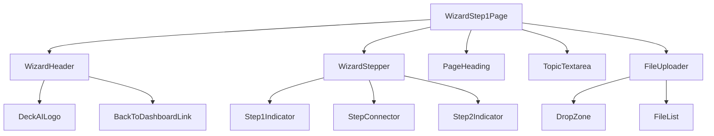
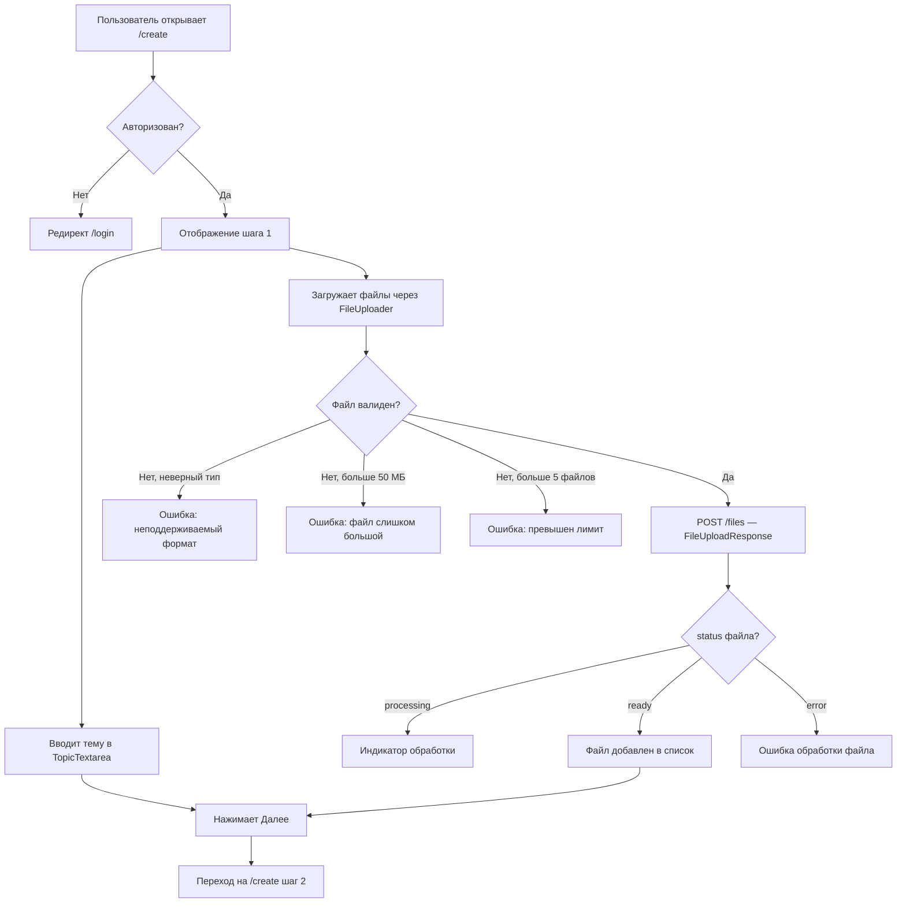

## Содержание

- [Обзор](#обзор)
- [Компоненты экрана](#компоненты-экрана)
- [Пользовательский сценарий](#пользовательский-сценарий)
- [Связь с API](#связь-с-api)
- [Валидации на фронте](#валидации-на-фронте)
- [Примечания](#примечания)

---

## Обзор

**Роут:** `/create` (step 1)
**Доступ:** требует авторизации; неавторизованный пользователь — редирект на `/login`
**Назначение:** Сбор входных данных для презентации. Пользователь описывает тему в свободной форме и загружает файлы, которые станут источниками для RAG-пайплайна.

---

## Компоненты экрана



---

### `WizardHeader`

**Тип:** organism
**Назначение:** Упрощённая шапка wizard-страниц: логотип слева, ссылка «Вернуться к дашборду» справа. Заменяет полный `Navbar` лендинга.

| Prop / State           | Тип        | Описание                                  |
|------------------------|------------|-------------------------------------------|
| `logoHref`             | `string`   | Ссылка логотипа (обычно `/dashboard`)     |
| `backLabel`            | `string`   | Текст ссылки: «← Вернуться к дашборду»   |
| `backHref`             | `string`   | href: предположительно `/dashboard`       |

**Состояния компонента:**
- `idle` — статичная шапка, нет интерактивных состояний.

---

### `WizardStepper`

**Тип:** molecule
**Назначение:** Индикатор прогресса по шагам wizard. Показывает текущий шаг, завершённые и предстоящие. **Переиспользуется** на всех шагах wizard.

> Полное описание — в [components.md](../components.md#wizardstepper).

| Prop / State     | Тип            | Описание                                                    |
|------------------|----------------|-------------------------------------------------------------|
| `steps`          | `StepConfig[]` | Массив шагов: `{ id, label, status }`                      |
| `currentStep`    | `1 \| 2`       | Номер активного шага                                        |

На шаге 1: шаг 1 — активен (фиолетовый круг), шаг 2 — неактивен (серый круг).

---

### `TopicTextarea`

**Тип:** molecule
**Назначение:** Текстовое поле для описания темы презентации в свободной форме. Содержит иконку, заголовок, подзаголовок и счётчик символов.

| Prop / State   | Тип                      | Описание                                                         |
|----------------|--------------------------|------------------------------------------------------------------|
| `value`        | `string`                 | Текущий текст темы                                               |
| `onChange`     | `(v: string) => void`    | Коллбек изменения                                                |
| `maxLength`    | `number`                 | Максимум 2000 символов                                           |
| `placeholder`  | `string`                 | «Например: Презентация для инвесторов о нашем стартапе...»       |
| `charCount`    | `number` (derived)       | Текущая длина `value`; отображается как «{n} / 2000 символов»    |

**Тексты (из скриншота):**
- Заголовок: «Опишите тему презентации»
- Подзаголовок: «Расскажите, о чём презентация и какие ключевые моменты нужно раскрыть»
- Placeholder: «Например: Презентация для инвесторов о нашем стартапе в сфере AI. Нужно показать проблему, решение, размер рынка, бизнес-модель и команду...»
- Счётчик: «0 / 2000 символов»

**Состояния компонента:**
- `empty` — поле пустое, счётчик «0 / 2000», кнопка «Далее» заблокирована (если тема обязательна).
- `filling` — пользователь вводит текст, счётчик обновляется в реальном времени.
- `limit_warning` — длина приближается к 2000 (например, >1800): счётчик подсвечивается предупреждающим цветом.
- `limit_reached` — длина = 2000: ввод заблокирован.

---

### `FileUploader`

**Тип:** organism
**Назначение:** Drag-and-drop зона загрузки файлов с поддержкой мультиселекта и отображением очереди загрузки.

> Переиспользуется. Полное описание — в [components.md](../components.md#fileuploader).

| Prop / State      | Тип                          | Описание                                            |
|-------------------|------------------------------|-----------------------------------------------------|
| `files`           | `UploadedFile[]`             | Список загруженных / загружаемых файлов             |
| `onFilesChange`   | `(files: File[]) => void`    | Коллбек добавления файлов                           |
| `onFileRemove`    | `(fileId: string) => void`   | Коллбек удаления файла из списка                    |
| `maxFiles`        | `number`                     | 5                                                   |
| `maxSizeMb`       | `number`                     | 50                                                  |
| `acceptedFormats` | `string[]`                   | `['pdf', 'docx', 'xlsx', 'csv']`                    |

На шаге 1 используется с `presentationId = undefined` (файлы загружаются до создания презентации; `presentation_id` передаётся после `POST /presentations` на шаге 2).

**Текст drop-зоны (из скриншота):**
- Заголовок блока: «Загрузите файлы с данными»
- Подзаголовок: «PDF, DOCX, XLSX, CSV — до 50 МБ на файл, до 5 файлов»
- Drop-зона: иконка загрузки + «Нажмите для выбора файлов» + «или перетащите их сюда»

---

## Пользовательский сценарий



**Шаги:**
1. Пользователь открывает `/create`; проверка авторизации.
2. Вводит описание темы в `TopicTextarea` (необязательно, если загружены файлы).
3. Перетаскивает файлы в `FileUploader` или выбирает через диалог.
4. Для каждого файла немедленно вызывается `POST /files` (асинхронная индексация).
5. После заполнения нажимает «Далее» — данные формы сохраняются в локальном состоянии (Zustand / React Context), переход на шаг 2.

---

## Связь с API

| Действие пользователя            | Метод | Эндпоинт  | Ссылка                                                                           |
|----------------------------------|-------|-----------|----------------------------------------------------------------------------------|
| Выбирает/бросает файл в drop-зону | POST  | `/files`  | [generateSlides.md](../../03_backend/02_rest_methods/generateSlides.md) → файл сначала загружается, индексируется |

> Тема презентации (`prompt`) передаётся позже — при `POST /presentations` на шаге 2.

**Ответ `POST /files`:**

```typescript
interface FileUploadResponse {
  file_id: string;  // uuid — сохраняется в локальном state для шага 2
  status: "uploading" | "processing" | "ready" | "error";
  task_id?: string; // для polling GET /tasks/{task_id}
}
```

---

## Валидации на фронте

| Поле / действие    | Правило                                              | Сообщение пользователю                             |
|--------------------|------------------------------------------------------|----------------------------------------------------|
| Тема (`prompt`)    | Максимум 2000 символов                               | Счётчик «{n} / 2000 символов»; ввод блокируется   |
| Формат файла       | Разрешены: PDF, DOCX, XLSX, CSV                      | «Формат файла не поддерживается»                   |
| Размер файла       | Максимум 50 МБ на файл                               | «Файл слишком большой. Максимум 50 МБ»             |
| Количество файлов  | Максимум 5                                           | «Достигнут лимит: не более 5 файлов»               |
| Переход «Далее»    | Хотя бы одно из полей заполнено (тема ИЛИ ≥1 файл)  | «Добавьте тему или загрузите файл»                 |

---

