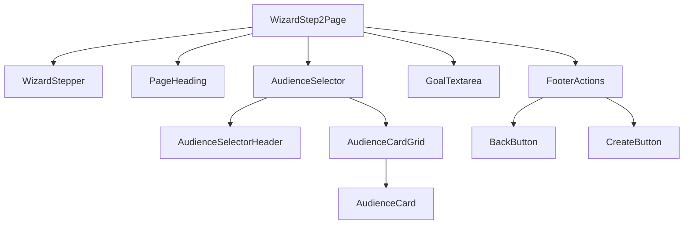
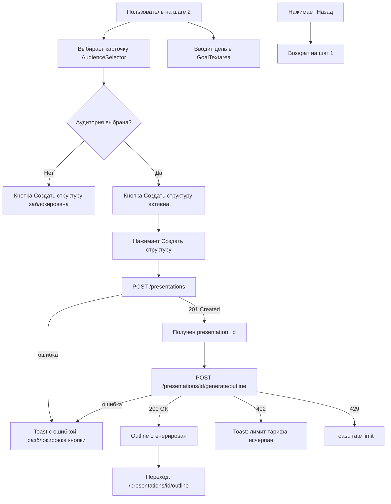

## Содержание

- [Обзор](#обзор)
- [Компоненты экрана](#компоненты-экрана)
- [Пользовательский сценарий](#пользовательский-сценарий)
- [Связь с API](#связь-с-api)
- [Валидации на фронте](#валидации-на-фронте)
- [Примечания](#примечания)

---

## Обзор

**Роут:** `/create` (step 2)
**Доступ:** требует авторизации; требует наличия данных шага 1 в состоянии (тема или файлы)
**Назначение:** Уточнение контекста для LLM — выбор целевой аудитории и описание цели презентации. По нажатию «Создать структуру» последовательно вызываются `POST /presentations` и `POST /presentations/{id}/generate/outline`.

---

## Компоненты экрана



---

### `WizardStepper`

**Тип:** molecule
**Назначение:** Индикатор прогресса — на шаге 2 оба пункта активны: шаг 1 завершён, шаг 2 текущий.

> Переиспользуется. Полное описание — в [components.md](../components.md#wizardstepper).

На шаге 2: шаг 1 — завершён (фиолетовый круг с галочкой или номером), коннектор — фиолетовый, шаг 2 — активен (фиолетовый круг).

---

### `AudienceSelector`

**Тип:** organism
**Назначение:** Карточный grid-селектор аудитории. Single-select: выбор одной карточки снимает выделение с остальных.

| Prop / State   | Тип                           | Описание                                               |
|----------------|-------------------------------|--------------------------------------------------------|
| `value`        | `AudienceType \| null`        | Текущий выбранный тип аудитории                        |
| `onChange`     | `(v: AudienceType) => void`   | Коллбек при выборе карточки                            |
| `options`      | `AudienceOption[]`            | Массив вариантов: `{ id, emoji, label, apiValue }`     |

**Варианты карточек (из скриншота):**

| Позиция | Emoji | Label       | API `audience` value |
|---------|-------|-------------|----------------------|
| 1       | 💰    | Инвестор    | `investor`           |
| 2       | 🏆    | Менеджмент  | `management`         |
| 3       | 🤝    | Клиент      | `client`             |
| 4       | 👥    | Команда     | `team`               |
| 5       | 🎓    | Обучение    | `student`            |
| 6       | 📊    | Консалтинг  | `custom` ⚠️          |

**Состояния компонента:**
- `idle` — все карточки без выделения, ни одна не выбрана.
- `selected` — одна карточка подсвечена (border фиолетовый / filled-фон).
- `disabled` — всё поле заблокировано (например, во время API-вызова).

---

### `GoalTextarea`

**Тип:** molecule
**Назначение:** Текстовое поле для описания основной цели презентации в свободной форме.

| Prop / State   | Тип                      | Описание                                                            |
|----------------|--------------------------|---------------------------------------------------------------------|
| `value`        | `string`                 | Текущий текст цели                                                  |
| `onChange`     | `(v: string) => void`    | Коллбек изменения                                                   |
| `placeholder`  | `string`                 | Пример цели (из скриншота — см. ниже)                               |

**Тексты (из скриншота):**
- Заголовок блока: «Основная цель презентации»
- Подзаголовок: «Что вы хотите донести до аудитории?»
- Placeholder: «Например: Убедить инвесторов вложить $2M в наш раунд Series A, показав размер рынка и наше конкурентное преимущество...»

**Состояния компонента:**
- `idle` — поле пустое, placeholder отображается.
- `filling` — пользователь вводит текст.

---

### `FooterActions`

**Тип:** molecule
**Назначение:** Панель действий нижней части страницы: «← Назад» и «Создать структуру →». Управляет переходом между шагами и запуском генерации.

| Prop / State   | Тип              | Описание                                                                   |
|----------------|------------------|----------------------------------------------------------------------------|
| `onBack`       | `() => void`     | Возврат на шаг 1 без потери данных                                         |
| `onSubmit`     | `() => void`     | Запуск цепочки API: `POST /presentations` → `POST .../generate/outline`    |
| `isLoading`    | `boolean`        | `true` во время API-вызовов — кнопка «Создать структуру» показывает спиннер |
| `isDisabled`   | `boolean`        | `true` если аудитория не выбрана                                           |

**Тексты (из скриншота):**
- Левая кнопка: «← Назад» (текстовая ссылка)
- Правая кнопка: «Создать структуру →» (фиолетовая заливка)

**Состояния компонента:**
- `idle` — обе кнопки активны.
- `loading` — кнопка «Создать структуру» заблокирована, отображает спиннер.
- `disabled` — кнопка «Создать структуру» недоступна (аудитория не выбрана).
- `error` — после ошибки API кнопка разблокируется, toast с описанием ошибки.

---

## Пользовательский сценарий



**Шаги:**
1. Пользователь выбирает аудиторию из grid (обязательно).
2. Опционально вводит цель в `GoalTextarea`.
3. Нажимает «Создать структуру →» — запускается цепочка API:
   - `POST /presentations` с `title`, `prompt`, `audience`, загруженными `file_id`.
   - При успехе — `POST /presentations/{id}/generate/outline`.
4. Во время ожидания (≤10 с) кнопка показывает спиннер.
5. После получения `Outline` — переход на экран просмотра/редактирования структуры.

---

## Связь с API

| Действие пользователя                   | Метод | Эндпоинт                                      | Ссылка                                                                               |
|-----------------------------------------|-------|-----------------------------------------------|--------------------------------------------------------------------------------------|
| Нажимает «Создать структуру» (шаг 1)   | POST  | `/presentations`                              | [createPresentation.md](../../03_backend/02_rest_methods/createPresentation.md)      |
| Нажимает «Создать структуру» (шаг 2)   | POST  | `/presentations/{id}/generate/outline`        | [generateOutline.md](../../03_backend/02_rest_methods/generateOutline.md)            |

**Тело `POST /presentations`** формируется из данных обоих шагов:

```typescript
// Данные из шага 1
const step1 = {
  prompt: topicTextareaValue,          // из шага 1
  source_file_ids: uploadedFileIds,    // из шага 1, FileUploadResponse.file_id[]
};

// Данные из шага 2
const step2 = {
  audience: selectedAudience,          // AudienceType
};

const body: PresentationCreate = {
  title: generateTitleFromPrompt(step1.prompt),
  prompt: step1.prompt,
  audience: step2.audience,
  language: "ru",
};
```

Ссылка на DTO: [PresentationCreate](../../00_overview/03_interfaces.md)

**Тело `POST /presentations/{id}/generate/outline`:**

```typescript
const outlineRequest: GenerateOutlineRequest = {
  prompt: step1.prompt,
  audience: step2.audience,
  source_file_ids: step1.source_file_ids,
};
```

Ссылка на DTO: [GenerateOutlineRequest](../../00_overview/03_interfaces.md)

---

## Валидации на фронте

| Поле / действие        | Правило                                         | Сообщение пользователю                                |
|------------------------|-------------------------------------------------|-------------------------------------------------------|
| Аудитория              | Обязательно выбрать одну карточку               | Кнопка «Создать структуру» заблокирована до выбора   |
| Цель (`GoalTextarea`)  | Необязательно                                   | —                                                     |
| API 402                | Лимит тарифа исчерпан                           | Toast: «Лимит презентаций достигнут. Обновите тариф» |
| API 429                | Rate limit                                      | Toast: «Слишком много запросов. Повторите через {n} с» |

---
