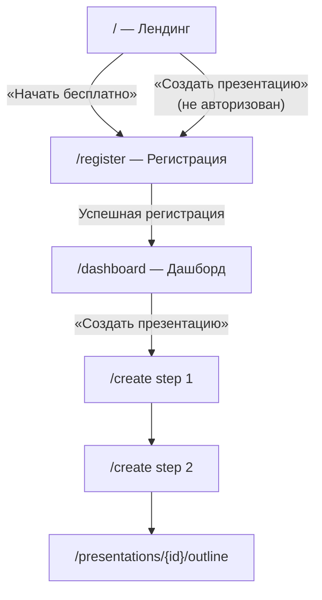
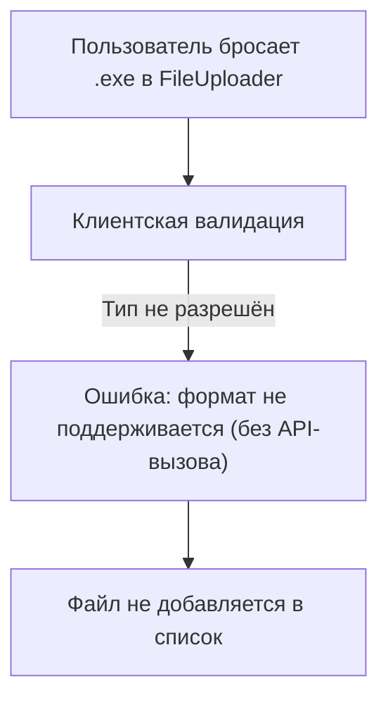
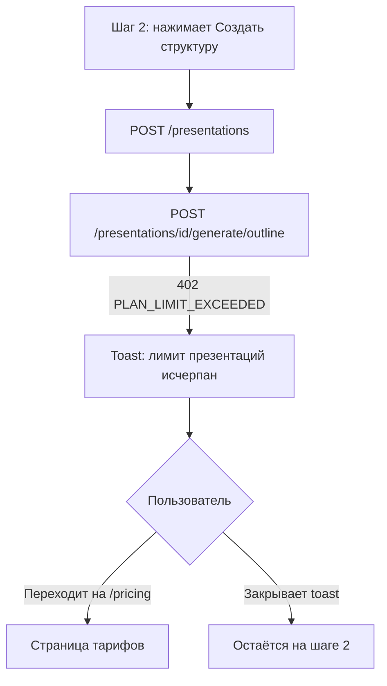
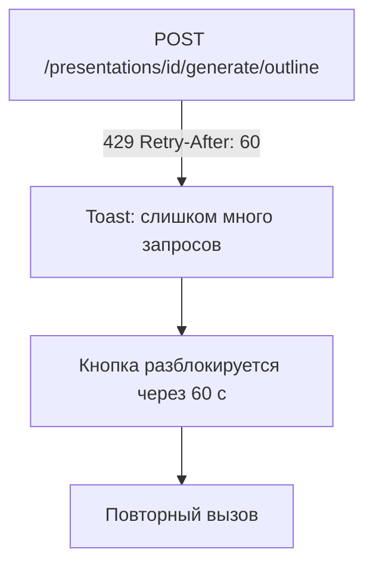
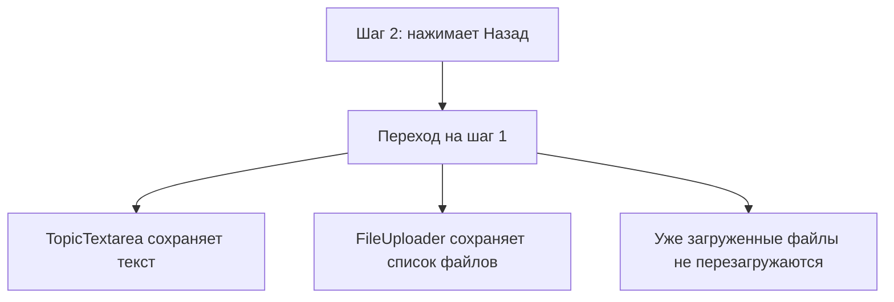

## Содержание

- [Флоу 1: Создание первой презентации (happy path)](#флоу-1-создание-первой-презентации-happy-path)
- [Флоу 2: Новый пользователь — регистрация и первая презентация](#флоу-2-новый-пользователь--регистрация-и-первая-презентация)
- [Флоу 3: Граничные случаи wizard](#флоу-3-граничные-случаи-wizard)
- [Сводная таблица API-вызовов по флоу](#сводная-таблица-api-вызовов-по-флоу)

---

## Флоу 1: Создание первой презентации (happy path)

Авторизованный пользователь создаёт новую презентацию из нуля через wizard.

```mermaid
flowchart LR
    Landing["/ — Лендинг\n«Создать презентацию»"]
    Step1["/create step 1\nДанные и контент"]
    Step2["/create step 2\nАудитория и цель"]
    Outline["/presentations/{id}/outline\nПросмотр структуры"]
    Generation["/presentations/{id}\nГенерация слайдов"]
    Editor["/presentations/{id}/edit\nРедактор слайдов"]

    Landing -->|"Нажал «Создать презентацию»\n(авторизован)"| Step1
    Step1 -->|"Ввёл тему + загрузил файлы\nнажал «Далее»"| Step2
    Step2 -->|"Выбрал аудиторию + цель\nнажал «Создать структуру»"| Outline
    Outline -->|"Одобрил структуру\nнажал «Создать слайды»"| Generation
    Generation -->|"Слайды готовы\n(WebSocket done)"| Editor
```

**Детальные шаги:**

1. Пользователь на `/` нажимает «Создать презентацию»; JWT в cookie — редирект на `/create`.
2. **Шаг 1 (Данные и контент):**
   - Вводит тему в `TopicTextarea`.
   - Перетаскивает файлы в `FileUploader`; каждый файл — `POST /files` → `FileUploadResponse.file_id`.
   - Ожидает статус `ready` для каждого файла.
   - Нажимает «Далее».
3. **Шаг 2 (Аудитория и цель):**
   - Выбирает аудиторию из `AudienceSelector`.
   - Опционально описывает цель в `GoalTextarea`.
   - Нажимает «Создать структуру →».
4. **API-цепочка:**
   - `POST /presentations` → `presentation_id`.
   - `POST /presentations/{id}/generate/outline` → `Outline` (≤10 с).
5. **Экран структуры** (`/presentations/{id}/outline`): пользователь просматривает и при необходимости редактирует список слайдов.
6. Нажимает «Создать слайды» → `POST /presentations/{id}/generate/slides` → `TaskResponse (202)`.
7. **Генерация** (≤60 с): WebSocket-события `slide_completed` обновляют прогресс.
8. Событие `generation_done` → переход на `/presentations/{id}/edit`.

---

## Флоу 2: Новый пользователь — регистрация и первая презентация

**Отличия от happy path:**
- Пользователь попадает на `/register`, а не сразу в wizard.
- После регистрации — на `/dashboard`, откуда открывает wizard.
- Первый раз может не иметь файлов — wizard должен разрешать продолжение только с темой (без файлов).

---

## Флоу 3: Граничные случаи wizard

### 3a. Загрузка невалидного файла

### 3b. Превышение лимита тарифного плана

### 3c. Rate limit при генерации outline

### 3d. Возврат на шаг 1 (данные не теряются)

Данные wizard должны храниться в клиентском стейте (Zustand / React Context) на протяжении всей сессии в `/create`.

---

## Сводная таблица API-вызовов по флоу

| Шаг wizard       | Действие пользователя             | Метод | Эндпоинт                                      | Синхронный? | Ссылка                                                                          |
|------------------|-----------------------------------|-------|-----------------------------------------------|:-----------:|---------------------------------------------------------------------------------|
| Шаг 1            | Добавляет файл в FileUploader     | POST  | `/files`                                      | Нет (202)   | [generateSlides.md](../03_backend/02_rest_methods/generateSlides.md)            |
| Шаг 1 (optional) | Проверяет статус индексации файла | GET   | `/tasks/{task_id}`                            | —           | —                                                                               |
| Шаг 2            | Нажимает «Создать структуру» (1)  | POST  | `/presentations`                              | Да (201)    | [createPresentation.md](../03_backend/02_rest_methods/createPresentation.md)   |
| Шаг 2            | Нажимает «Создать структуру» (2)  | POST  | `/presentations/{id}/generate/outline`        | Да (200)    | [generateOutline.md](../03_backend/02_rest_methods/generateOutline.md)         |
| Outline screen   | Подтверждает структуру            | POST  | `/presentations/{id}/generate/slides`         | Нет (202)   | [generateSlides.md](../03_backend/02_rest_methods/generateSlides.md)           |
| Editor           | Перегенерирует слайд              | POST  | `/presentations/{id}/generate/slide/{slide_id}` | Да (200)  | [regenerateSlide.md](../03_backend/02_rest_methods/regenerateSlide.md)         |
