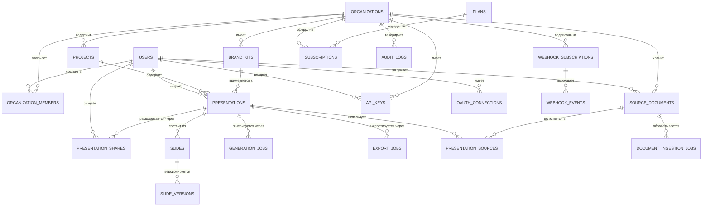
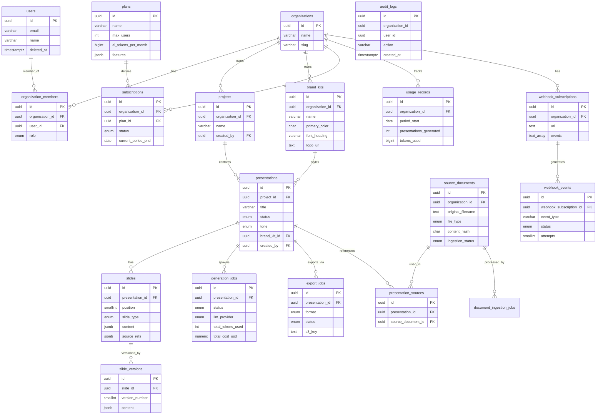
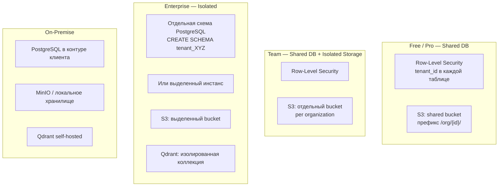

Раздел фиксирует информационную модель, структуру хранилища и правила целостности данных. Здесь описываются ключевые сущности, связи, ограничения и атрибуты, необходимые для согласованной реализации.

Материалы используются для проектирования схемы, миграций и контроля совместимости изменений на уровне данных.

---

## Хранилища данных

| Хранилище | Назначение |
|-----------|-----------|
| [PostgreSQL (реляционные таблицы)](./relational) | Пользователи, организации, презентации, billing, audit |
| [Document Store (MongoDB)](./documents) | Трейсы генерации, аналитика просмотров |
| [Qdrant (векторное хранилище)](./vector_store) | Embeddings чанков исходных документов (RAG) |
| [Redis (кэш и очереди)](./cache) | Сессии, семантический кэш LLM, checkpoint генерации |

---

# Проектирование базы данных PresentAI

> **Версия:** 1.0 | **Дата:** 01.03.2026 | **СУБД:** PostgreSQL 16

---

## 1. Концептуальный уровень

### 1.1 Предметная область

Система генерации презентаций оперирует следующими **ключевыми понятиями**:

- **Пользователь** — физическое лицо, авторизованное в системе.
- **Организация (Тенант)** — юридическое или функциональное объединение пользователей. Единица изоляции данных (multi-tenancy).
- **Проект** — папка для группировки презентаций внутри организации.
- **Презентация** — основной артефакт. Содержит слайды, источники данных и параметры генерации.
- **Слайд** — единица контента внутри презентации. Имеет тип, содержимое и ссылки на источники.
- **Brand Kit** — корпоративный стиль: цвета, шрифты, логотип, шаблон слайда.
- **Исходный документ** — загруженный пользователем файл или URL, используемый RAG-пайплайном.
- **Задача генерации** — асинхронная задача создания презентации через LLM.
- **Задача экспорта** — асинхронная задача конвертации в PPTX / PDF / Google Slides.
- **Задача индексации** — асинхронная задача обработки исходного документа (chunking + embedding).
- **Подписка** — тарифный план организации (Free / Pro / Team / Enterprise).
- **API-ключ** — токен для внешних интеграций.
- **Webhook** — подписка на события системы с гарантией доставки.
- **Аудит-лог** — запись каждого значимого действия в системе.

### 1.2 Концептуальная ER-диаграмма (сущности и связи)



### 1.3 Список сущностей и их роли

| Сущность | Домен | Описание |
|----------|-------|----------|
| `users` | Auth | Учётная запись пользователя |
| `organizations` | Auth | Тенант (компания или команда) |
| `organization_members` | Auth | Членство пользователя в организации + роль |
| `oauth_connections` | Auth | OAuth-токены внешних сервисов (Google, Microsoft…) |
| `api_keys` | Auth | API-ключи для внешних интеграций |
| `plans` | Billing | Тарифные планы с лимитами |
| `subscriptions` | Billing | Подписка организации на план |
| `usage_records` | Billing | Учёт потребления по периодам |
| `projects` | Presentation | Группа презентаций |
| `brand_kits` | Presentation | Корпоративный стиль |
| `presentations` | Presentation | Презентация |
| `slides` | Presentation | Слайд презентации |
| `slide_versions` | Presentation | Версия контента слайда |
| `presentation_shares` | Presentation | Ссылка для шеринга |
| `source_documents` | AI | Исходный документ / URL |
| `presentation_sources` | AI | Связь презентации с источниками |
| `document_ingestion_jobs` | AI | Задача индексации документа |
| `generation_jobs` | AI | Задача генерации презентации |
| `export_jobs` | AI | Задача экспорта |
| `webhook_subscriptions` | AI | Webhook-подписка |
| `webhook_events` | AI | Событие доставки webhook |
| `audit_logs` | Auth | Журнал аудита действий |

---

## 2. Логический уровень

### 2.1 Принципы нормализации (3NF)

Все таблицы спроектированы по правилам **Третьей нормальной формы**:

**1NF (Первая нормальная форма):**
- Каждый атрибут атомарен.
- Нет повторяющихся групп (массивы `TEXT[]` используются только для простых скалярных наборов — scopes, events; сложные структуры выделены в отдельные таблицы или JSONB).
- Каждая таблица имеет первичный ключ.

**2NF (Вторая нормальная форма):**
- Все таблицы имеют однополевой суррогатный PK (UUID), поэтому частичных зависимостей нет по определению.
- Составные естественные ключи при необходимости определены как `UNIQUE`-ограничения, а не PK.

**3NF (Третья нормальная форма):**
- Нет транзитивных зависимостей: например, данные тарифного плана (`max_users`, `ai_tokens_month`) вынесены в отдельную таблицу `plans` и связаны через `subscriptions`, а не дублируются в `organizations`.
- Контактные данные организации (название, slug) хранятся только в `organizations`, а не дублируются в `projects` или `presentations`.
- Информация о пользователе (email, name) — только в `users`.
- Статусы генерации хранятся в `generation_jobs`, а не в `presentations` (в `presentations` — только денормализованный `status` для быстрой фильтрации, обновляемый триггером).

**Допустимые отклонения (обоснованная денормализация):**
- `presentations.status` — денормализованный кэш из `generation_jobs.status` для производительности.
- `slides.content` — JSONB-структура сложного типа содержимого слайда (текстовые блоки, ссылки на чарты) хранится единым документом из-за высокой вариативности схемы.
- `audit_logs` — не связан FK с `users` и `organizations` (только хранит ID) для гарантированной записи даже при удалении пользователя.

### 2.2 Логическая модель (нормализованные таблицы)

#### Домен Auth

**users**
```
id UUID PK
email VARCHAR(255) UNIQUE NOT NULL
name VARCHAR(255) NOT NULL
avatar_url TEXT
is_email_verified BOOLEAN
last_login_at TIMESTAMPTZ
created_at TIMESTAMPTZ
updated_at TIMESTAMPTZ
deleted_at TIMESTAMPTZ  -- soft delete
```

**organizations**
```
id UUID PK
name VARCHAR(255) NOT NULL
slug VARCHAR(100) UNIQUE NOT NULL
logo_url TEXT
website TEXT
created_at TIMESTAMPTZ
updated_at TIMESTAMPTZ
deleted_at TIMESTAMPTZ
```

**organization_members**
```
id UUID PK
organization_id UUID FK → organizations.id
user_id UUID FK → users.id
role org_role ENUM(admin, editor, viewer)
invited_by UUID FK → users.id
joined_at TIMESTAMPTZ
created_at TIMESTAMPTZ
UNIQUE(organization_id, user_id)
```

**oauth_connections**
```
id UUID PK
user_id UUID FK → users.id
provider oauth_provider ENUM(google, microsoft, notion, confluence)
provider_user_id VARCHAR(255) NOT NULL
access_token_encrypted BYTEA NOT NULL
refresh_token_encrypted BYTEA
token_expires_at TIMESTAMPTZ
scopes TEXT[]
created_at TIMESTAMPTZ
updated_at TIMESTAMPTZ
UNIQUE(user_id, provider)
```

**api_keys**
```
id UUID PK
organization_id UUID FK → organizations.id
name VARCHAR(100) NOT NULL
key_hash CHAR(64) NOT NULL  -- SHA-256 of the actual key
key_prefix CHAR(8) NOT NULL -- first 8 chars for display
scopes TEXT[]
rate_limit_per_minute INT
created_by UUID FK → users.id
expires_at TIMESTAMPTZ
last_used_at TIMESTAMPTZ
revoked_at TIMESTAMPTZ
created_at TIMESTAMPTZ
```

#### Домен Billing

**plans**
```
id UUID PK
name VARCHAR(50) UNIQUE NOT NULL
max_users INT  -- NULL = unlimited
max_presentations_per_month INT  -- NULL = unlimited
max_file_size_mb INT NOT NULL
max_source_files_per_presentation INT NOT NULL
ai_tokens_per_month BIGINT  -- NULL = unlimited
storage_gb INT NOT NULL
features JSONB NOT NULL  -- feature flags
price_monthly_usd NUMERIC(10,2)
price_yearly_usd NUMERIC(10,2)
is_active BOOLEAN DEFAULT TRUE
created_at TIMESTAMPTZ
updated_at TIMESTAMPTZ
```

**subscriptions**
```
id UUID PK
organization_id UUID FK → organizations.id UNIQUE
plan_id UUID FK → plans.id
status subscription_status ENUM(active, trialing, past_due, canceled, expired)
current_period_start TIMESTAMPTZ NOT NULL
current_period_end TIMESTAMPTZ NOT NULL
external_subscription_id VARCHAR(255)  -- Stripe subscription ID
cancel_at_period_end BOOLEAN DEFAULT FALSE
created_at TIMESTAMPTZ
updated_at TIMESTAMPTZ
```

**usage_records**
```
id UUID PK
organization_id UUID FK → organizations.id
period_start DATE NOT NULL
period_end DATE NOT NULL
presentations_generated INT DEFAULT 0
slides_generated INT DEFAULT 0
tokens_used BIGINT DEFAULT 0
storage_bytes_used BIGINT DEFAULT 0
cost_usd NUMERIC(12,4) DEFAULT 0
created_at TIMESTAMPTZ
updated_at TIMESTAMPTZ
UNIQUE(organization_id, period_start)
```

#### Домен Presentation

**brand_kits**
```
id UUID PK
organization_id UUID FK → organizations.id
name VARCHAR(100) NOT NULL
is_default BOOLEAN DEFAULT FALSE
primary_color CHAR(7)     -- HEX #RRGGBB
secondary_color CHAR(7)
background_color CHAR(7)
accent_color CHAR(7)
text_color CHAR(7)
logo_url TEXT
font_heading VARCHAR(100)
font_body VARCHAR(100)
additional_settings JSONB  -- extra colors, spacing, etc.
template_s3_key TEXT       -- PPTX template file
created_by UUID FK → users.id
created_at TIMESTAMPTZ
updated_at TIMESTAMPTZ
UNIQUE(organization_id, name)
```

**projects**
```
id UUID PK
organization_id UUID FK → organizations.id
name VARCHAR(255) NOT NULL
description TEXT
is_archived BOOLEAN DEFAULT FALSE
created_by UUID FK → users.id
created_at TIMESTAMPTZ
updated_at TIMESTAMPTZ
```

**presentations**
```
id UUID PK
project_id UUID FK → projects.id
title VARCHAR(500) NOT NULL
description TEXT
status presentation_status ENUM(draft, outline_ready, generating, ready, error)
tone tone_type ENUM(formal, business, persuasive, technical, educational, friendly)
target_audience VARCHAR(100)
language CHAR(5) DEFAULT 'ru'
slide_count INT DEFAULT 0
thumbnail_url TEXT
brand_kit_id UUID FK → brand_kits.id
current_generation_job_id UUID  -- FK → generation_jobs.id (delayed)
created_by UUID FK → users.id
created_at TIMESTAMPTZ
updated_at TIMESTAMPTZ
deleted_at TIMESTAMPTZ
```

**slides**
```
id UUID PK
presentation_id UUID FK → presentations.id
position SMALLINT NOT NULL
title TEXT
content JSONB NOT NULL       -- {type, blocks[], chart_config, table_data, ...}
slide_type slide_type ENUM(title_slide, content, chart, table, image, quote, divider)
status slide_status ENUM(pending, generating, ready, error)
source_refs JSONB            -- [{source_id, chunk_id, text_fragment}, ...]
hallucination_flags JSONB    -- [{claim, flag_type, confidence}, ...]
created_at TIMESTAMPTZ
updated_at TIMESTAMPTZ
UNIQUE(presentation_id, position)
```

**slide_versions**
```
id UUID PK
slide_id UUID FK → slides.id
version_number SMALLINT NOT NULL
content JSONB NOT NULL
created_by UUID FK → users.id
created_at TIMESTAMPTZ
UNIQUE(slide_id, version_number)
```

**presentation_shares**
```
id UUID PK
presentation_id UUID FK → presentations.id
token CHAR(32) UNIQUE NOT NULL
access_level share_access ENUM(view, comment, edit)
password_hash TEXT
expires_at TIMESTAMPTZ
view_count INT DEFAULT 0
created_by UUID FK → users.id
created_at TIMESTAMPTZ
```

#### Домен AI

**source_documents**
```
id UUID PK
organization_id UUID FK → organizations.id
original_filename TEXT NOT NULL
file_type source_file_type ENUM(pdf, docx, xlsx, csv, pptx, url, image, txt)
s3_key TEXT        -- NULL for URL sources
file_size_bytes BIGINT
content_hash CHAR(64)  -- SHA-256 for deduplication
url TEXT           -- for web sources
ingestion_status ingestion_status ENUM(pending, processing, indexed, failed)
page_count INT
word_count INT
created_by UUID FK → users.id
created_at TIMESTAMPTZ
updated_at TIMESTAMPTZ
```

**presentation_sources**
```
id UUID PK
presentation_id UUID FK → presentations.id
source_document_id UUID FK → source_documents.id
added_at TIMESTAMPTZ DEFAULT now()
UNIQUE(presentation_id, source_document_id)
```

**document_ingestion_jobs**
```
id UUID PK
source_document_id UUID FK → source_documents.id
status job_status ENUM(pending, running, completed, failed, retrying)
chunks_created INT
embeddings_created INT
worker_id VARCHAR(100)
started_at TIMESTAMPTZ
completed_at TIMESTAMPTZ
error_message TEXT
retry_count SMALLINT DEFAULT 0
created_at TIMESTAMPTZ
```

**generation_jobs**
```
id UUID PK
presentation_id UUID FK → presentations.id
status job_status ENUM(pending, running, completed, failed, retrying)
llm_provider llm_provider ENUM(claude, gpt4o, llama3, gemini)
outline_tokens_used INT
generation_tokens_used INT
total_tokens_used INT
total_cost_usd NUMERIC(10,6)
slides_completed INT DEFAULT 0
slides_total INT
worker_id VARCHAR(100)
started_at TIMESTAMPTZ
completed_at TIMESTAMPTZ
error_message TEXT
retry_count SMALLINT DEFAULT 0
created_at TIMESTAMPTZ
```

**export_jobs**
```
id UUID PK
presentation_id UUID FK → presentations.id
format export_format ENUM(pptx, pdf, google_slides, png, web)
status job_status ENUM(pending, running, completed, failed)
s3_key TEXT
google_file_id TEXT
download_url TEXT
expires_at TIMESTAMPTZ
slide_range INT[]          -- NULL = all slides
created_by UUID FK → users.id
started_at TIMESTAMPTZ
completed_at TIMESTAMPTZ
error_message TEXT
created_at TIMESTAMPTZ
```

**webhook_subscriptions**
```
id UUID PK
organization_id UUID FK → organizations.id
url TEXT NOT NULL
secret_hash TEXT NOT NULL   -- HMAC-SHA256 secret
events TEXT[] NOT NULL      -- event type filters
is_active BOOLEAN DEFAULT TRUE
created_by UUID FK → users.id
created_at TIMESTAMPTZ
updated_at TIMESTAMPTZ
```

**webhook_events**
```
id UUID PK
webhook_subscription_id UUID FK → webhook_subscriptions.id
event_type VARCHAR(100) NOT NULL
payload JSONB NOT NULL
status webhook_status ENUM(pending, delivered, failed, abandoned)
http_status_code SMALLINT
attempts SMALLINT DEFAULT 0
last_attempt_at TIMESTAMPTZ
next_retry_at TIMESTAMPTZ
delivered_at TIMESTAMPTZ
created_at TIMESTAMPTZ
```

**audit_logs**
```
id UUID PK
organization_id UUID NOT NULL   -- no FK, хранить даже после удаления орг.
user_id UUID                    -- no FK, nullable для системных действий
action VARCHAR(100) NOT NULL    -- 'presentation.created', 'user.deleted', ...
resource_type VARCHAR(50)
resource_id UUID
metadata JSONB
ip_address INET
user_agent TEXT
created_at TIMESTAMPTZ NOT NULL
-- PARTITION BY RANGE (created_at)
```

### 2.3 Диаграмма связей (логический уровень)



---

## 3. Физический уровень

### 3.1 Хранилище и СУБД

- **PostgreSQL 16** — основная реляционная БД.
- **RDS Multi-AZ** в cloud; альтернативно — managed PostgreSQL (Yandex Managed PostgreSQL, Supabase) для РФ-региона.
- **Репликация:** streaming replication с 1 read replica для отчётных запросов.
- **Бэкап:** continuous WAL archiving в S3 + ежедневный pg_dump snapshot. RPO = 5 мин.

### 3.2 Row-Level Security (RLS)

Для Free/Pro тарифов данные разных тенантов изолируются через **PostgreSQL RLS**:

```sql
-- Пример для таблицы presentations
ALTER TABLE presentations ENABLE ROW LEVEL SECURITY;

CREATE POLICY tenant_isolation ON presentations
    USING (
        project_id IN (
            SELECT id FROM projects
            WHERE organization_id = current_setting('app.current_org_id')::uuid
        )
    );
```

Для Enterprise — выделенная схема PostgreSQL (`CREATE SCHEMA tenant_<id>`) или отдельный инстанс.

### 3.3 Партиционирование

**`audit_logs`** — партиционирование по диапазону дат (ежемесячные партиции):

```sql
CREATE TABLE audit_logs (
    id UUID NOT NULL,
    created_at TIMESTAMPTZ NOT NULL,
    ...
) PARTITION BY RANGE (created_at);

CREATE TABLE audit_logs_2026_03
    PARTITION OF audit_logs
    FOR VALUES FROM ('2026-03-01') TO ('2026-04-01');
```

Retention policy: партиции старше 90 дней архивируются в S3, локальные удаляются.

**`usage_records`** — партиционирование по `period_start` (квартальные партиции).

**`webhook_events`** — партиционирование по `created_at` (ежемесячные). TTL 7 дней.

### 3.4 Ключевые индексы (сводная таблица)

| Таблица | Поля | Тип | Назначение |
|---------|------|-----|-----------|
| `users` | `email` | BTREE UNIQUE | Логин по email |
| `users` | `deleted_at` | BTREE PARTIAL (WHERE deleted_at IS NULL) | Фильтр активных |
| `organization_members` | `(organization_id, user_id)` | BTREE UNIQUE | Целостность членства |
| `organization_members` | `user_id` | BTREE | Организации пользователя |
| `presentations` | `project_id, created_at DESC` | BTREE | Список презентаций в проекте |
| `presentations` | `created_by, status` | BTREE | Мои презентации по статусу |
| `slides` | `presentation_id, position` | BTREE | Порядок слайдов |
| `source_documents` | `content_hash` | BTREE | Дедупликация файлов |
| `source_documents` | `organization_id, ingestion_status` | BTREE | Фильтр по статусу |
| `generation_jobs` | `presentation_id` | BTREE | Задачи презентации |
| `generation_jobs` | `status, created_at` | BTREE PARTIAL | Очередь pending-задач |
| `webhook_events` | `webhook_subscription_id, status` | BTREE | Pending events |
| `webhook_events` | `next_retry_at` | BTREE PARTIAL (WHERE status = 'pending') | Retry scheduler |
| `audit_logs` | `organization_id, created_at DESC` | BTREE | Лог организации |
| `api_keys` | `key_hash` | BTREE UNIQUE | Проверка ключа |

### 3.5 Миграции

Инструмент: **Alembic** (Python). Стратегия zero-downtime:
1. **Expand:** добавить новый столбец (nullable).
2. **Migrate:** бэкфилл данных батчами.
3. **Contract:** добавить NOT NULL constraint, удалить старый столбец.

Все изменения схемы backward-compatible на период деплоя.

### 3.6 Шифрование

- **At-rest:** AES-256 через RDS/disk encryption.
- **Чувствительные поля:** `oauth_connections.access_token_encrypted`, `oauth_connections.refresh_token_encrypted` — зашифрованы на уровне приложения (AES-256-GCM) перед записью в БД. Ключи хранятся в HashiCorp Vault / AWS KMS.
- **API-ключи:** в БД хранится только SHA-256 хеш (`key_hash`), не сам ключ. Префикс (`key_prefix`) — только для отображения пользователю.

### 3.7 Схема управления данными тенантов (Multi-tenancy)



---

## 4. Связанные файлы

- **[relational.md](./relational)** — детальное описание каждой PostgreSQL-таблицы: поля, индексы, ограничения, триггеры, типичные запросы.
- **[documents.md](./documents)** — схемы документных коллекций (трейсы генерации, аналитика).
- **[vector_store.md](./vector_store)** — схема векторного хранилища Qdrant: chunking, HNSW-параметры, similarity-запросы.
- **[cache.md](./cache)** — Redis-схемы: сессии, семантический кэш LLM, checkpoint генерации, rate limiting.
