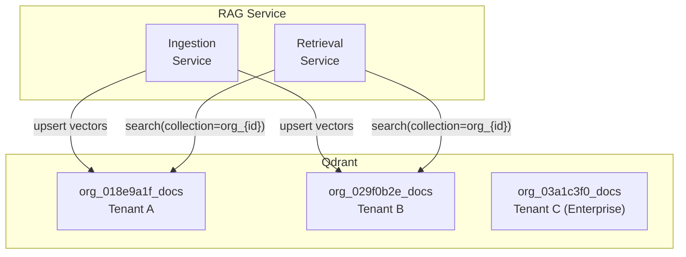
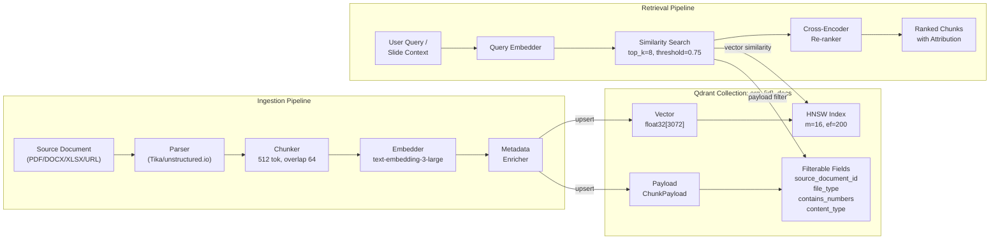
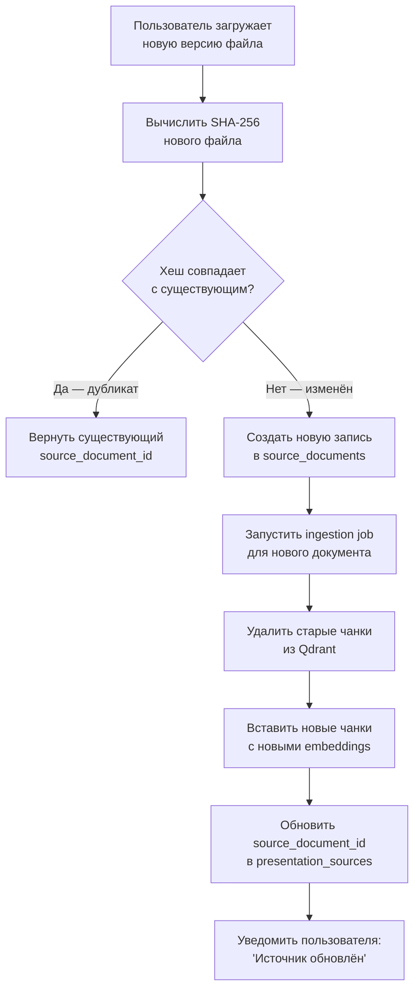

# Векторное хранилище: Qdrant

> **Версия Qdrant:** 1.9+
> **Модель эмбеддингов:** `text-embedding-3-large` (OpenAI) / `BGE-M3` (on-premise)
> **Размерность вектора:** 3072 (text-embedding-3-large) / 1024 (BGE-M3)
> **Метрика расстояния:** Cosine similarity

---

## Архитектура коллекций

Изоляция тенантов реализована через **отдельную коллекцию на организацию**:

```
org_{organization_id}_docs   — документы организации
```

Это обеспечивает:
- Полную изоляцию данных (Enterprise требование)
- Независимое масштабирование коллекций
- Возможность удаления всех данных тенанта одной операцией



---

## Схема записи (вектора/чанка)

```typescript
interface DocumentChunk {
  // Идентификатор записи в Qdrant
  id: string;                     // UUID v4, совпадает с chunk_id в метаданных Qdrant

  // Вектор
  vector: number[];               // float32[3072] — text-embedding-3-large

  // Payload (метаданные, фильтруемые при поиске)
  payload: ChunkPayload;
}

interface ChunkPayload {
  // Привязка к источнику
  source_document_id: string;     // UUID → source_documents.id в PostgreSQL
  organization_id: string;        // UUID тенанта (дублирование для быстрой фильтрации)
  presentation_ids: string[];     // UUID[] — в каких презентациях используется

  // Содержимое чанка
  text: string;                   // Исходный текст чанка (до 512 токенов)
  text_length: number;            // Длина в символах
  token_count: number;            // Примерное количество токенов

  // Локализация в документе
  chunk_index: number;            // Порядковый номер чанка в документе (0-based)
  chunk_total: number;            // Общее количество чанков в документе
  page_number?: number;           // Номер страницы (для PDF/DOCX)
  page_total?: number;            // Всего страниц
  section_title?: string;         // Заголовок раздела/секции (если распознан)
  table_index?: number;           // Номер таблицы (для Excel/CSV чанков)

  // Метаданные источника
  source_filename: string;        // Оригинальное имя файла
  file_type: string;              // 'pdf' | 'docx' | 'xlsx' | 'csv' | 'pptx' | 'url' | 'image'
  source_url?: string;            // URL (для web-источников)
  language: string;               // BCP 47: 'ru', 'en-US'

  // Временные метки
  extracted_at: string;           // ISO 8601 — время извлечения из документа
  indexed_at: string;             // ISO 8601 — время индексации в Qdrant
  source_modified_at?: string;    // Дата изменения исходного файла

  // Контентные теги (для точной фильтрации)
  contains_numbers: boolean;      // Есть ли числовые данные
  contains_table: boolean;        // Является ли табличными данными
  content_type: string;           // 'text' | 'table' | 'chart_data' | 'heading' | 'list'
  embedding_model: string;        // 'text-embedding-3-large' | 'bge-m3'
}
```

---

## Диаграмма структуры



---

## Стратегия Chunking

### Параметры

| Параметр | Значение | Обоснование |
|----------|---------|-------------|
| Размер чанка | 512 токенов | Баланс между контекстом и точностью поиска |
| Overlap | 64 токена | ~12.5% перекрытия для сохранения контекста на границе |
| Метод разбиения | Рекурсивный по разделителям | Учёт структуры документа |

### Алгоритм рекурсивного разбиения

Разделители применяются в порядке приоритета:

```python
SEPARATORS = [
    "\n\n\n",   # 1. Разрыв между секциями (3+ пустые строки)
    "\n\n",     # 2. Параграфы
    "\n",       # 3. Строки
    ". ",       # 4. Предложения
    " ",        # 5. Слова (крайний случай)
]
```

### Специальная обработка по типам

| Тип файла | Стратегия |
|-----------|-----------|
| **PDF/DOCX** | Разбивка по параграфам, заголовки сохраняются как `section_title`. Каждая страница — отдельный семантический блок |
| **XLSX/CSV** | Каждая таблица как единый чанк (до 512 токен), иначе — по строкам с заголовком. `contains_table = true` |
| **PPTX** | Каждый слайд — отдельный чанк. Заголовок слайда → `section_title` |
| **URL** | HTML-to-markdown → рекурсивное разбиение. Мета-теги → `section_title` |
| **Изображения** | OCR-текст → стандартное разбиение. `content_type = 'ocr_text'` |

### Обработка перекрытий

```
[Chunk 1: tokens 0-511  ]
                  [Chunk 2: tokens 448-959]
                                    [Chunk 3: tokens 896-1407]
         ← 64 tok →       ← 64 tok →
            overlap           overlap
```

---

## Параметры HNSW-индекса

| Параметр | Значение | Описание |
|----------|---------|---------|
| `m` | 16 | Количество bi-directional связей на узел. При 16 — оптимальный баланс качество/память |
| `ef_construction` | 200 | Размер динамического списка при построении. Больше = точнее индекс, медленнее построение |
| `ef_search` (runtime) | 128 | Размер beam при поиске. Рекомендуется ef ≥ top_k × 4 |
| `full_scan_threshold` | 10 000 | До этого числа векторов — брутфорс точнее HNSW |
| `on_disk` | true | Векторы хранятся на диске (mmap) при > 1M векторов |
| Метрика | Cosine | Оптимальна для text embeddings; нормализация включена |

### Конфигурация коллекции (Qdrant API)

```python
from qdrant_client import QdrantClient
from qdrant_client.models import (
    VectorParams, Distance, HnswConfigDiff,
    OptimizersConfigDiff, PayloadSchemaType
)

client = QdrantClient(url="http://qdrant:6333")

client.create_collection(
    collection_name=f"org_{organization_id}_docs",
    vectors_config=VectorParams(
        size=3072,                      # text-embedding-3-large
        distance=Distance.COSINE,
        on_disk=True,                   # Хранение на диске для больших коллекций
    ),
    hnsw_config=HnswConfigDiff(
        m=16,
        ef_construct=200,
        full_scan_threshold=10_000,
        on_disk=True,
    ),
    optimizers_config=OptimizersConfigDiff(
        deleted_threshold=0.2,          # Перестроить при 20% удалённых
        vacuum_min_vector_number=1000,
        default_segment_number=2,
        max_segment_size=200_000,       # ~200k векторов на сегмент
    ),
)

# Создать индексы по payload-полям для фильтрации
client.create_payload_index(
    collection_name=f"org_{organization_id}_docs",
    field_name="source_document_id",
    field_schema=PayloadSchemaType.KEYWORD,
)
client.create_payload_index(
    collection_name=f"org_{organization_id}_docs",
    field_name="file_type",
    field_schema=PayloadSchemaType.KEYWORD,
)
client.create_payload_index(
    collection_name=f"org_{organization_id}_docs",
    field_name="contains_numbers",
    field_schema=PayloadSchemaType.BOOL,
)
client.create_payload_index(
    collection_name=f"org_{organization_id}_docs",
    field_name="content_type",
    field_schema=PayloadSchemaType.KEYWORD,
)
```

---

## Пример similarity-запроса с фильтрами

```python
from qdrant_client import QdrantClient
from qdrant_client.models import Filter, FieldCondition, MatchValue, SearchRequest
from openai import OpenAI

openai_client = OpenAI()
qdrant_client = QdrantClient(url="http://qdrant:6333")

async def retrieve_chunks_for_slide(
    query_text: str,
    organization_id: str,
    source_document_ids: list[str],  # Фильтр по загруженным документам презентации
    top_k: int = 8,
    score_threshold: float = 0.72,
    prefer_numeric: bool = False,    # Для fact-check запросов
) -> list[dict]:
    """
    Similarity-поиск чанков с фильтрацией по документам и приоритизацией числовых данных.
    """
    # 1. Получить embedding запроса
    embedding_response = openai_client.embeddings.create(
        model="text-embedding-3-large",
        input=query_text,
    )
    query_vector = embedding_response.data[0].embedding

    # 2. Построить фильтр
    must_conditions = [
        FieldCondition(
            key="source_document_id",
            match=MatchValue(any=source_document_ids)  # Только документы презентации
        ),
    ]

    # Если ищем числовые факты — приоритизировать чанки с числами
    if prefer_numeric:
        must_conditions.append(
            FieldCondition(key="contains_numbers", match=MatchValue(value=True))
        )

    query_filter = Filter(must=must_conditions)

    # 3. Выполнить similarity search
    results = qdrant_client.search(
        collection_name=f"org_{organization_id}_docs",
        query_vector=query_vector,
        query_filter=query_filter,
        limit=top_k * 2,               # Берём больше для re-ranking
        score_threshold=score_threshold,
        with_payload=True,
        with_vectors=False,            # Векторы не нужны в ответе
    )

    # 4. Re-ranking (cross-encoder) при наличии достаточно результатов
    if len(results) > top_k:
        results = cross_encoder_rerank(query_text, results, top_k)

    # 5. Форматировать для LLM-контекста
    chunks = []
    for point in results:
        payload = point.payload
        chunks.append({
            "chunk_id": str(point.id),
            "text": payload["text"],
            "similarity_score": point.score,
            "source": {
                "source_document_id": payload["source_document_id"],
                "filename": payload["source_filename"],
                "page_number": payload.get("page_number"),
                "section_title": payload.get("section_title"),
                "file_type": payload["file_type"],
            },
            "contains_numbers": payload["contains_numbers"],
            "content_type": payload["content_type"],
        })

    return chunks


# Пример вызова
chunks = await retrieve_chunks_for_slide(
    query_text="Какой объём рынка AI-презентаций и темп роста?",
    organization_id="018e9a1f-b3c2-7654-9abc-def012345680",
    source_document_ids=[
        "018e9a1f-b3c2-7654-9abc-def012345682",
        "018e9a1f-b3c2-7654-9abc-def012345683",
    ],
    top_k=6,
    prefer_numeric=True,  # Ищем числовые данные о рынке
)
```

### Пример ответа

```json
[
  {
    "chunk_id": "chunk_a1b2c3d4-e5f6-7890-abcd-ef0123456789",
    "text": "Глобальный рынок AI-инструментов для создания презентаций оценивается в $2.1 млрд в 2026 году. Ожидаемый CAGR составляет 35% в период 2024–2028...",
    "similarity_score": 0.942,
    "source": {
      "source_document_id": "018e9a1f-b3c2-7654-9abc-def012345682",
      "filename": "market_research_2026.pdf",
      "page_number": 12,
      "section_title": "Анализ рынка",
      "file_type": "pdf"
    },
    "contains_numbers": true,
    "content_type": "text"
  },
  {
    "chunk_id": "chunk_b2c3d4e5-f6a7-8901-bcde-f01234567890",
    "text": "| Год | Объём рынка ($B) | YoY рост |\n|-----|----------------|----------|\n| 2024 | 1.15 | — |\n| 2025 | 1.56 | 35.6% |\n| 2026 | 2.11 | 35.3% |",
    "similarity_score": 0.891,
    "source": {
      "source_document_id": "018e9a1f-b3c2-7654-9abc-def012345682",
      "filename": "market_research_2026.pdf",
      "page_number": 14,
      "section_title": "Динамика рынка",
      "file_type": "pdf"
    },
    "contains_numbers": true,
    "content_type": "table"
  }
]
```

---

## Стратегия обновления чанков при изменении источника

### Сценарий: пользователь повторно загружает обновлённую версию документа



### Алгоритм атомарного обновления чанков

```python
async def update_document_chunks(
    old_source_document_id: str,
    new_source_document_id: str,
    organization_id: str,
    new_chunks: list[ChunkPayload],
) -> None:
    collection = f"org_{organization_id}_docs"

    # 1. Найти все старые чанки документа
    old_chunk_ids = []
    offset = None
    while True:
        results, offset = qdrant_client.scroll(
            collection_name=collection,
            scroll_filter=Filter(must=[
                FieldCondition(key="source_document_id",
                               match=MatchValue(value=old_source_document_id))
            ]),
            limit=1000,
            with_payload=False,
            offset=offset,
        )
        old_chunk_ids.extend([str(r.id) for r in results])
        if offset is None:
            break

    # 2. Вставить новые чанки (upsert)
    qdrant_client.upsert(
        collection_name=collection,
        points=[
            PointStruct(
                id=chunk["chunk_id"],
                vector=chunk["vector"],
                payload=chunk["payload"],
            )
            for chunk in new_chunks
        ],
    )

    # 3. Удалить старые чанки батчами
    BATCH_SIZE = 100
    for i in range(0, len(old_chunk_ids), BATCH_SIZE):
        qdrant_client.delete(
            collection_name=collection,
            points_selector=old_chunk_ids[i:i + BATCH_SIZE],
        )
```

### TTL-стратегия для embeddings

- Чанки документов, **не связанных ни с одной презентацией** более 90 дней → автоматическое удаление (фоновый job).
- При удалении организации → удаление всей коллекции `org_{id}_docs` одной операцией.
- При удалении конкретного документа → удаление чанков через payload-фильтр.

```python
# Очистка orphan-чанков (не используемых в презентациях)
async def cleanup_orphan_chunks(organization_id: str) -> int:
    cutoff_date = (datetime.now() - timedelta(days=90)).isoformat()

    # Найти source_document_ids без активных presentation_sources
    # (запрос к PostgreSQL) → orphan_doc_ids

    deleted = 0
    for doc_id in orphan_doc_ids:
        result = qdrant_client.delete(
            collection_name=f"org_{organization_id}_docs",
            points_selector=Filter(must=[
                FieldCondition(key="source_document_id", match=MatchValue(value=doc_id)),
                FieldCondition(key="indexed_at", range={"lt": cutoff_date}),
            ]),
        )
        deleted += result.operation_id  # approx count
    return deleted
```
